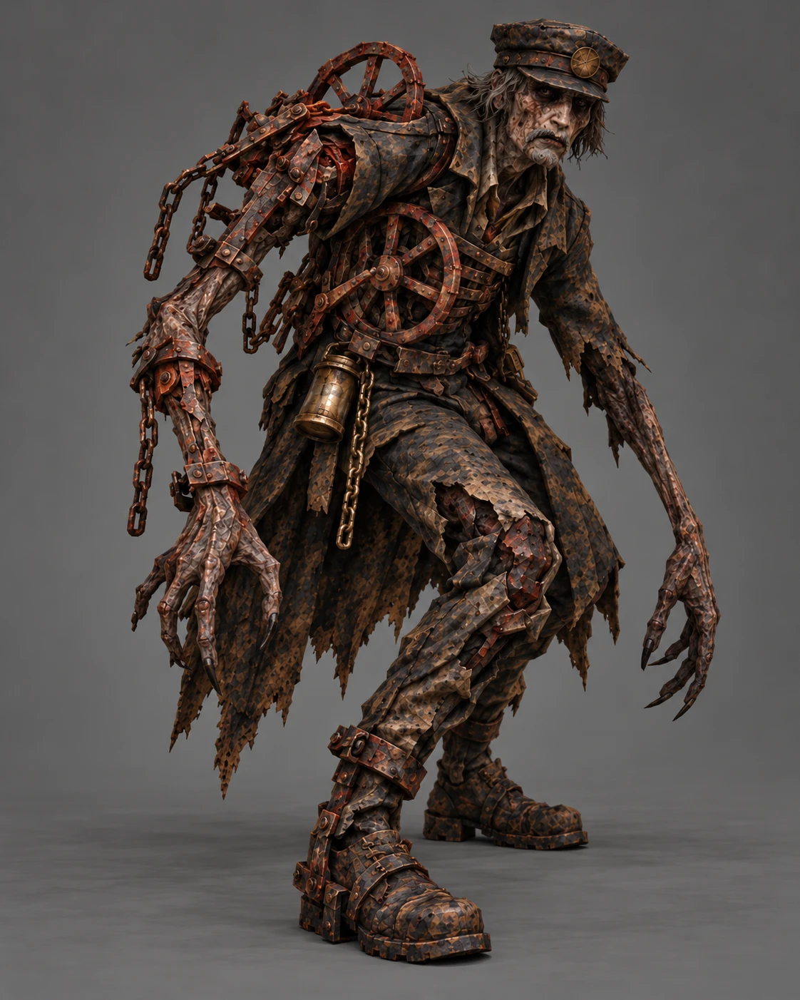
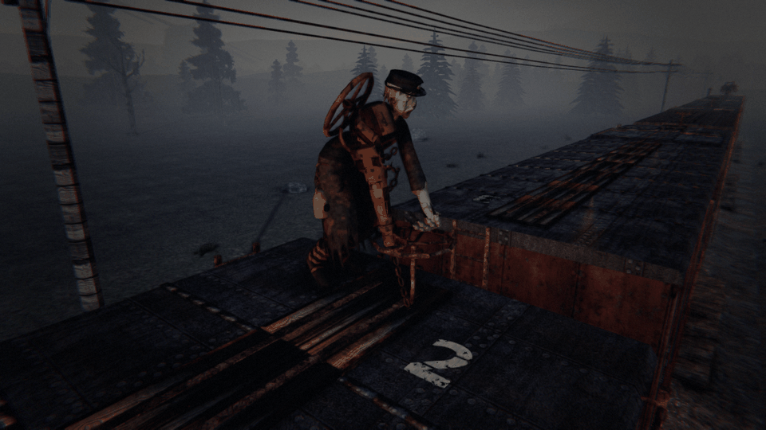
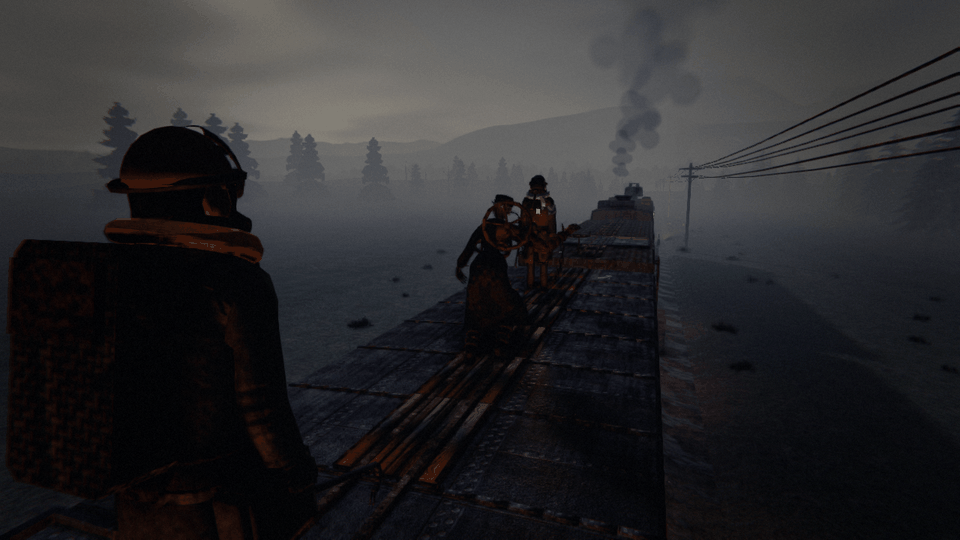
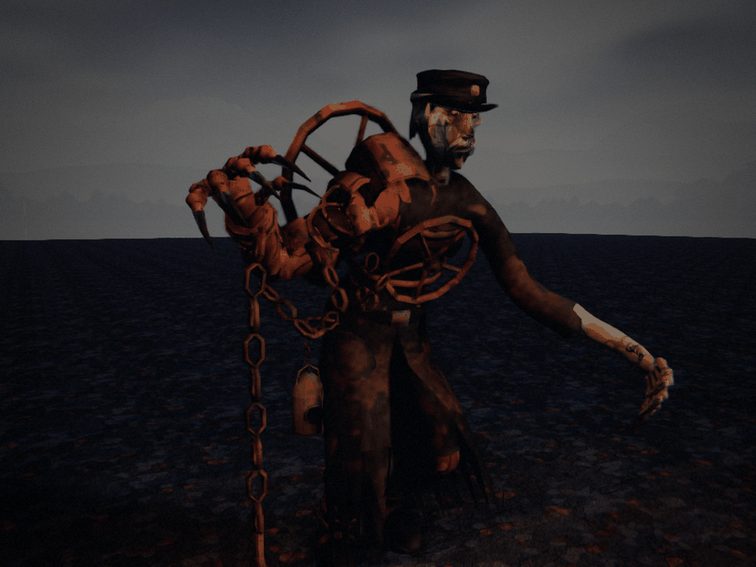

# THE BRAKEMAN — a dead railwayman still winding the brakes on

*Creature design, G1 (enemy design), 8 Oct 2026. **Status: the director's brief of 8 Oct 2026, built overnight (queue
#101, ARCHITECTURE §8 note 364).** Every call the brief left open is taken below and marked **(G1's call)**. Numbers are a
first pass in the roster's units (player health 100, roof run 3.5 m/s, a crowbar blow = 1, a gun round = 4 blows).*



**As built** (`dt screenshot --view brakeman|brakemancorner`, `--brakeman walk|wind|flee|cornered|lash|climb|drop`;
`dt art clip brakeman <clip>`): tools/blender/brakeman.py, his colour baked by tools/models/recipes/brakeman.py; drawn by
Art/CreatureArt.Train.cs. His body, coat and boots are one fused, settled skin and his head and neck another (the collar
hides the join); the coat's skirt (its hem rotted into ragged tongues), the long knuckled fingers with their hooked
claws (the left forearm starved to wrist-thick, the right thick under its iron), the iron lames and plates, both brake
wheels, the boots' iron straps, the chains (the lash on its own four bones) and the brass lamp hung on its chain off an
iron hook at his belt, clear of the coat, over it. 9,647 triangles, 32 bones. A wound car's brake wheel is drawn turned, its chain taken up round the
staff, and its shoes spark on the wheels while it runs.





> **Something is walking the roofs, winding every brake on. One of you can chase it off. It takes two to catch it.**

---

## 1. Why a brakeman

Before air brakes, a freight's brakemen rode the roofs and wound each car's brake wheel by hand when the engineer
whistled for brakes: the most dangerous job on the railway, done in all weather, jumping the gaps between cars. The
Corruption kept one at it. It's still doing its job, car by car, toward one end of the train, and its job is to stop
you.

## 2. Roster entry (GDD §21, CORRUPTED HUMANS)

**THE BRAKEMAN** · *on the roofs, on the move; never with a crew of one*
A stooped man in a rotted railway coat and cap, his arm grown into rusted chain and a brake wheel, his boots strapped
in iron.
> **RULE: chase it alone, catch it together.**

It climbs up at one end of the train and works toward the other, car by car, winding each car's handbrake on: the train
slows, and on a climb it stalls. One crewmate can chase it off the roofs; it drops out of sight, waits under or inside the
train, and comes up somewhere else to start again. Only two crewmates closing on it from both sides can corner it, and
only cornered can it be hurt.

**Sense:** sight (players on the roofs). **Zone:** corrupted human (the roofs; one at a time). **Want:** Split (it stops the train). **Cost:** 3.

## 3. What it looks like (art brief, GDD §26.5)

From the director's reference: a gaunt old railwayman, stooped and long-armed, in a knee-length coat rotted to rags at
the hem, a peaked railway cap with a brass badge, a grey moustache on a grey, blotched face with sunken eyes. Its right
shoulder and arm have grown into rusted iron: chain hanging in loops from the shoulder, plates riveted down the forearm,
**a brake wheel grown into its back and another strapped to its chest**. A brass lamp on a chain at its belt. The hands
are long and clawed, the knuckles swollen. Boots bound in iron straps. Rust-red and soot-black, everything riveted.

**Clips:** `walk` (stooped, quick, the chain swinging), `wind` (both clawed hands on a car's brake wheel, cranking, a
ratchet click a turn), `jump` (a gap, crouched), `flee` (low and fast), `drop` (over the side, hanging on the ladder
then gone), `climb` (up an end ladder), `cornered` (backing, the chain raised), `lash` (the chain swung at a face),
`hit`, `death` (pitching off the roof).

## 4. How it sounds (a request to the audio chat)

- **The winding** (the tell): a brake wheel's ratchet, click-click-click, then a long squeal as the shoes bite, from the
  car it's on; and the train's note dropping as the drag comes on.
- **Its steps on the roofs**: iron-shod, uneven, a drag of chain.
- **Cornered**: a low wheeze, the chain rattling.
- **Hidden**: under the train, a chain dragging on the ballast, under the wheels' noise.

## 5. Behaviour tree (App. A.8 format)

### THE BRAKEMAN · sight
```
ARRIVE    the train moving, a crew of two or more alive → it climbs up the end ladder of the car at one end of the
          train (the end furthest from the crew), facing the other end
WORK      walks the roofs toward the other end, car by car; at each car's brake wheel it WINDS it on (4 s)
          └ TELEGRAPH: the ratchet and the shoes' squeal from that car; the train slowing
          each car wound adds its handbrake's drag (a wound car's 0.3 m/s² of its mass); a crewmate unwinds one with
          Use held 1 s at its wheel (as any handbrake)
FLEE      a crewmate on the roofs within 12 m that it can see → it runs from them along the roofs (5 m/s, faster than
          a roof run), jumping the gaps
          ├ out of their sight, or 20 m clear, or at the end of the train → DROP: over the side, gone
          └ blows on it while it's running: it ducks them (no damage)
HIDE      under or inside the train, unseen, 30–60 s → it climbs up somewhere else (the car furthest from the crew)
          and starts again
CORNERED  crewmates on the roofs on both sides of it, each within 10 m → it can't run: it backs, the chain up
          ├ TELEGRAPH: the wheeze, the chain raised (1.5 s) → LASH the nearer one (30, never a kill), every 2.5 s
          ├ blows land now: 4 blows kill it (a gun round is 4) → it pitches off the roof, dead for the night
          └ one of them steps back out of 10 m → it runs again
NEVER     with a crew of one; never in a yard or a fort; never inside a car
```

**It never kills** (a lash is a bite; App. A.1). Its danger is the train: every car it winds is drag, and the drag adds
up with the length of the train. On a climb it stalls you, and a stalled train is what everything else in the dark is
waiting for.

## 6. The social test (§20)

| # | Test | Passes? |
|---|---|---|
| 1 | Describable in one phrase | ✔ "A dead brakeman winding your brakes on; trap it between two of you." |
| 2 | Answered better by two | ✔ The kill needs two by rule; one chases, one cuts it off. |
| 3 | Consequence now, death later | ✔ The drag now; the stall on the next climb. |
| 4 | A verb, not just a "don't" | ✔ Chase, unwind, flank, corner, kill. |
| 5 | Someone gets blamed | ✔ "You were meant to be at the FRONT!" |
| 6 | Fun to scream | ✔ "IT'S COMING YOUR WAY! STAY THERE!" |

## 7. Spawn rules (App. B.8 row)

| Enemy | Spawn context | Gates | Weighting |
|---|---|---|---|
| **The Brakeman** | On the roofs, at one end of a moving train | **Never with a crew of one** (the brief) · at least 4 cars · not in a yard, fort or tunnel · one at a time; back after it's driven off, gone for the night once killed | ×1 Local, ×1.5 Frontier, ×2 Dead Lines, ×2.5 Deep Territory; ×(cars ÷ 6); ×2 within 1 km of a climb over 2% |

## 8. Contradictions (App. B.1 conflict table)

| Pair | The bind |
|---|---|
| **The Gannet + the Brakeman** | Get up on the roofs and chase it vs. walking the roofs is what the Gannet dives at |
| **Draggers + the Brakeman** | Run the roofs after it vs. the edges the Draggers hold |
| **Cinder Hounds + the Brakeman** | Keep the speed up vs. it's winding the brakes on |

## 9. First-pass numbers (`enemies.json` `brakeman`)

| Field | Value | Why |
|---|---|---|
| `minCrew` / `minCars` | 2 / 4 | the brief: never solo; a short train has nowhere to run |
| `walk` / `flee` | 2.5 / 5 m/s | a roof run is 3.5: a lone chaser can't catch it |
| `windSeconds` | 4 | per car |
| `spook` / `lose` | 12 / 20 m | a chaser in sight within 12 m sends it running; 20 m clear it drops |
| `hide` | [30, 60] s | out of sight before it comes up again |
| `cornerSpan` | 10 m | a crewmate within this on each side corners it |
| `lashDamage` / `lashEvery` / `lashTelegraph` | 30 / 2.5 s / 1.5 s | |
| `health` | 4 | blows, landing only while it's cornered |
| `cost` | 3 | |

## 10. What the harness verifies

- `BrakemanTests`: never with a crew of one; arrives at the end furthest from the crew; winds car after car toward the
  other end, each wound car adding drag; a crewmate unwinds one; it flees a lone chaser and blows don't land; out of sight
  it drops and comes up elsewhere; two on both sides corner it and blows land; the lash never kills; the drag stalls a
  train on a climb; deterministic on the client.
- `BotsAnswerTheSixTests` (the bots, note NNN): a roof bot unwinds wound cars at their wheels and never winds the rake's
  handbrakes on; a lone bot keeps unwinding and never chases him; two roof bots hold the train's ends, close from both
  sides, corner him and kill him.

## 11. Decisions taken overnight (G1's calls, for the director)

1. **"Never spawns solo"** read as: never in a night with a crew of one alive (the brief's kill needs two). If it meant
   "never one Brakeman alone", it's a tuning number (`group`).
2. **The drag is the handbrake's own** (0.3 m/s² of the wound car's mass, train.json's `handbrakeDecel`), now counted on
   the engine's rake too, car by car.
3. **Every tier, weighted**; up with the train's length and a climb ahead (the brief: it scales with train length and is
   dangerous on climbing grades).
4. **It lashes when cornered** (30, never a kill).
