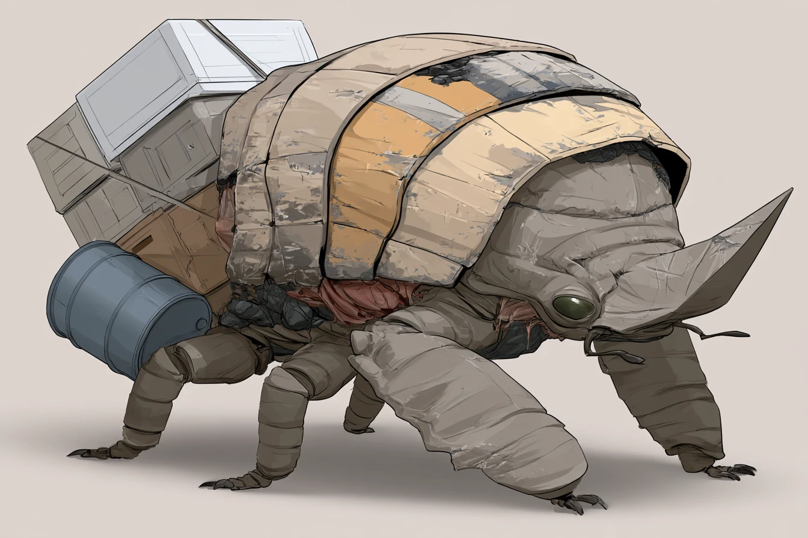

# THE FREIGHT BEETLE — it pushes the freight away from you

*Creature design, G1 (enemy design), 8 Oct 2026. **Status: the director's brief of 8 Oct 2026, built overnight (queue
#103, ARCHITECTURE §8 note 366).** Every call the brief left open is taken below and marked **(G1's call)**. Numbers are a
first pass in the roster's units (player health 100, run 5.5 m/s, a crowbar blow = 1).*



> **There's a beetle the size of a cart at the depot, and it pushes the crates away from whoever's nearest. Use that.**

---

## 1. What it is

A big, workmanlike beetle at a facility, built for pushing: a shovel of a head, huge forelimbs, and a plated back worn
and painted like old freight. It finds something movable (a crate, a barrel, a bale) and shoves it **directly away from
the nearest player**. Alone it's a nuisance: it pushes your freight off the platform or out into the wilderness. Two
players who understand it can steer it, and then it's a puzzle, and a loading tool: the freight goes where it's pushed,
even into a car.

## 2. Roster entry (GDD §21, OUTSIDE)

**THE FREIGHT BEETLE** · *at the facilities, among the freight*
A beetle the size of a handcart, shovel-headed, its back plated like a crate, shoving a load of freight across the yard.
> **RULE: it pushes away from whoever's nearest. Stand where you want it not to go.**

**Sense:** sight (the nearest player). **Zone:** outside (facilities). **Want:** Cargo. **Cost:** 1.

## 3. What it looks like (art brief, GDD §26.5)

From the director's reference: bulky and workmanlike, 2.4 m long and 1.4 m to the top of its back: a domed back of broad
overlapping plates worn and scuffed like painted freight (buff, ochre, a stripe of orange, grey patches, scorch), a
**shovel head** (a flat wedge of plate, scraped bright at the edge) under a hooded front plate, small glossy green-black
eyes and feeler-like mouthparts; **huge pushing forelimbs**, segmented and plated, wider than its head, and four thinner
legs behind with hooked feet; reddish soft flesh showing between the plates.

**Clips:** `idle` (settled, feelers working), `walk`, `brace` (head down behind a load, forelimbs set), `push` (heaving,
shoving forward in steady strides), `turn`, `startle` (rearing back off its load), `hit`, `death` (on its back).

## 4. How it sounds (a request to the audio chat)

- **Pushing** (the tell): a crate's scrape on gravel or boards, a barrel's rumble, in time with a heavy creature's
  strides; a chitinous creak.
- **Startled**: a clatter of plates and a hiss.

## 5. Behaviour tree (App. A.4 format)

### THE FREIGHT BEETLE · sight
```
WAIT      at a facility with loose freight, settled beside it; no player within 25 m → still
PICK      a player within 25 m → it takes the movable load nearest to it (a crate, a cargo crate, a heavy crate)
          └ TELEGRAPH: it braces behind the load, head down (1 s)
PUSH      it shoves the load DIRECTLY AWAY FROM THE NEAREST PLAYER (1.2 m/s; a heavy crate 0.8 m/s), walking behind it
          ├ the nearest player changes → the push turns with them (a 90°/s turn): two players steer it
          ├ into a car's open door at the floor, from a platform → the load's in the car (loaded, as if carried)
          ├ off a platform's edge → it falls (a keg may go off, as any)
          ├ a player within 1.5 m of its head → it rears back (STARTLE) and pushes on after 2 s
          └ no player within 25 m → it stops, and waits
HIT       blows: 6 kill it (a gun round is 4); 3 blows in 10 s drive it off its load for 30 s
NEVER     it never attacks anyone; it never pushes a body or a lamp
```

## 6. The social test (§20)

| # | Test | Passes? |
|---|---|---|
| 1 | Describable in one phrase | ✔ "A beetle that pushes the freight away from you." |
| 2 | Answered better by two | ✔ One player alone can only push it away; two can steer it. |
| 3 | Consequence now, death later | ✔ The freight going now; the time and the dark it costs later. |
| 4 | A verb, not just a "don't" | ✔ Steer, herd, use it to load, kill it. |
| 5 | Someone gets blamed | ✔ "You were NEAREST! It went your way!" |
| 6 | Fun to scream | ✔ "GET ROUND THE OTHER SIDE OF IT!" |

## 7. Spawn rules (App. B.4 row)

| Enemy | Spawn context | Gates | Weighting |
|---|---|---|---|
| **The Freight Beetle** | Beside a facility's loose freight | **Every tier** (G1's call) · only at a facility with loose freight · one at a stop | ×1 Local, ×1.25 Frontier, ×1.5 Dead Lines, ×1.5 Deep Territory |

## 8. Contradictions (App. B.1 conflict table)

| Pair | The bind |
|---|---|
| **Facility loading + the Freight Beetle** | Load fast vs. it pushes the freight off |
| **Grumblers + the Freight Beetle** | Steer it to the car vs. the crane's castings overhead |
| **The Moose + the Freight Beetle** | Two players steering it in the open vs. crowding is what the Moose minds |

## 9. First-pass numbers (`enemies.json` `freightBeetle`)

| Field | Value | Why |
|---|---|---|
| `notice` | 25 m | |
| `brace` | 1 s | |
| `push` / `pushHeavy` | 1.2 / 0.8 m/s | slower than a walk: you can get round it |
| `turn` | 90 °/s | |
| `startleWithin` / `startle` | 1.5 m / 2 s | |
| `health` / `driveOff` | 6 / 3 blows in 10 s | |
| `cost` | 1 | |

## 10. What the harness verifies

- `FreightBeetleTests`: still with no one near; pushes the nearest load straight away from the nearest player; the push
  turns when the nearest player changes (two players steer it into a car door from a platform, and the crate's loaded);
  off a platform's edge the crate falls; blows drive it off and kill it; it never harms anyone; deterministic.

## 11. Decisions taken overnight (G1's calls, for the director)

1. **Crates only** for now: the game's movable freight is crates (cargo, heavy and loot crates); barrels and bales come
   when the facilities have them.
2. **Harmless**; killable (6 blows) and driven off its load by 3 in 10 s.
3. **Every tier**; one at a stop with loose freight.
