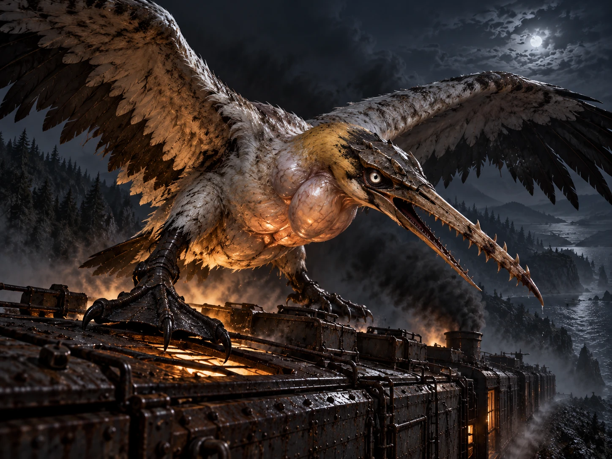
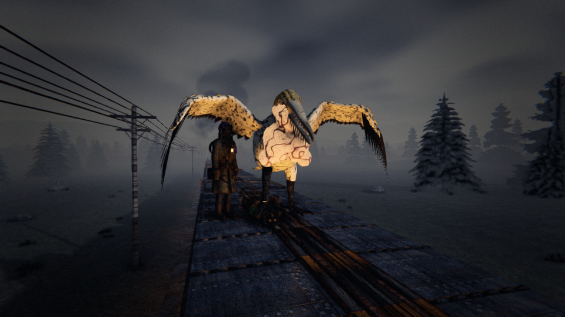
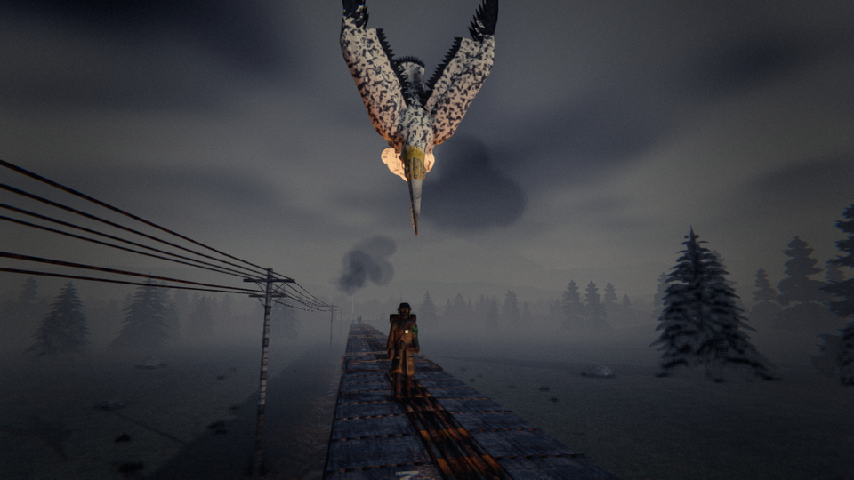
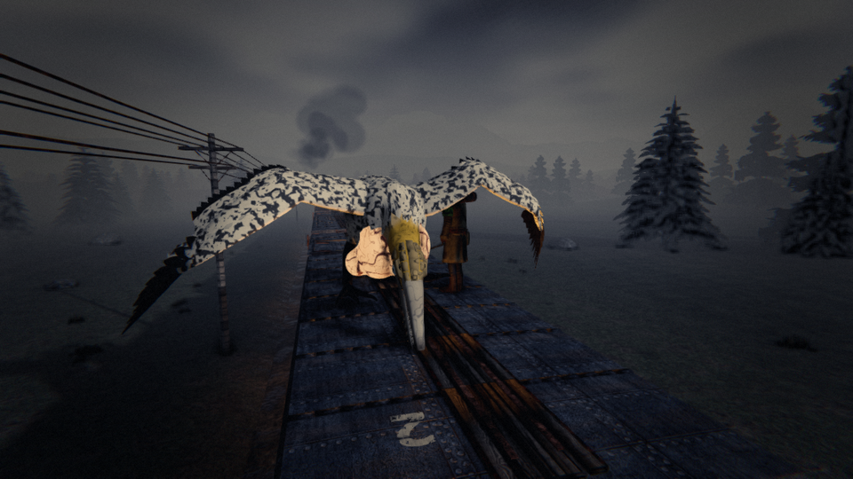
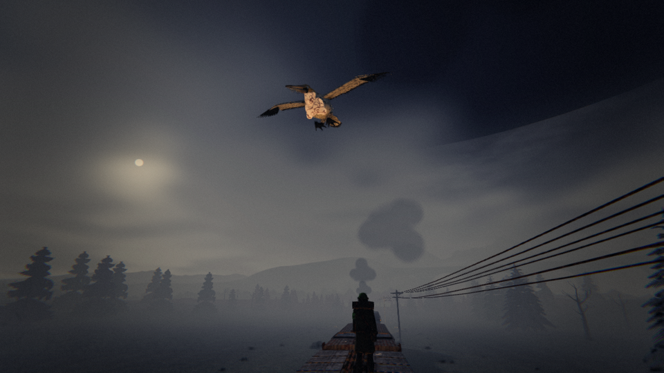
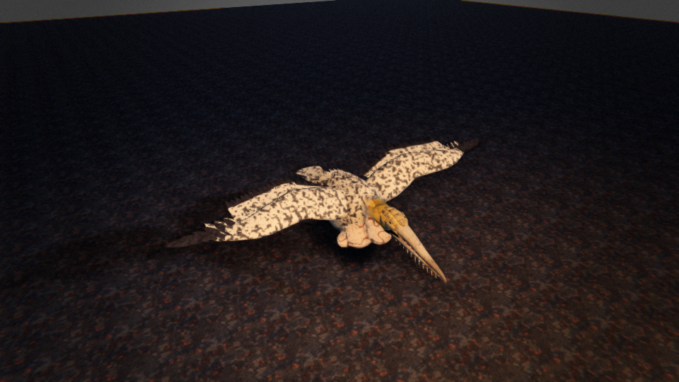

# THE GANNET — one enormous corrupted seabird that rides a fast train

*Creature design, G1 (enemy design), 7 Oct 2026. **Status: approved by the director, 7 Oct 2026 (queue #78, ARCHITECTURE
§8 note 340).** The director's redesign of the first draft's flock: one abnormally large bird, corrupted like the Moose,
that pecks, and pins and pecks whoever hits it. It fills the orchestrator outline's slot **S3** ("the kites":
`docs/design/orchestrator.md` §5.2), App. F.1's "fast, flying class may come later to answer the top-speed strategy".
Numbers are a first pass in the roster's units (player health 100, roof run 3.5 m/s, top speed 22 m/s, a gun round = 4
blows).*

**The director's answers (7 Oct 2026):** every tier, weighted (as the Moose); yes, it comes down for a mark on the ground
if the train's fast enough to keep it up; and a dead Gannet is worth a good deal.



**As built** (`dt screenshot --view gannetpin|gannetfold|gannetstuck|gannet`):







**The reference** (the director's, for the model): mottled, sooted white plumage, black-tipped primaries and a
sulphur-yellow head; a plated skull and a pale ringed eye; a serrated spear of a beak with a hooked tip, the jaw lined
with teeth-like serrations; huge translucent sacs on the throat and breast, glowing orange from within the light of the
fire; scaled black legs and hooked, webbed talons gripping the riveted roof of a car; the wings spread wider than the car.

> **A seabird the size of a cart, riding your smoke and diving at whoever walks the roofs. Hit it, and it comes down for you.**

---

## 1. Why a gannet, and why at speed

- **The line runs the Maritimes' coast**, and the northern gannet is the Gulf of St Lawrence's bird (Bonaventure Island,
  Cape St Mary's).
- **Gannets plunge-dive**: they spot prey from 10–40 m up, fold at the last moment and hit at about 24 m/s, and **once
  folded they can't correct**. That's the spotting and the miss.
- **Seabirds ride moving things.** They follow ships to soar on the updraft off the hull and the wake. A train at 18 m/s
  or more makes the same lift (its bow wave of air, the hot plume off the stack), and the Gannet holds station over it
  without a wingbeat. Below about 12 m/s the plume goes straight up, there's no wake, and it stalls and peels off.
- **So it boards at speed because speed is what keeps it up.** Everything else boards a slow train; the Gannet only a
  fast one. Running hot to outrun the Cinder Hounds brings the Gannet.
- **Corrupted like the Moose**: the Corruption exaggerates what lets it survive (§2). For a gannet that's the dive: the
  beak, the cushioning sacs, the size. One bird, grown monstrous.

## 2. Roster entry (GDD §21, FLANK)

**THE GANNET** · *over a fast train, in open country*
A seabird the size of a cart circling in your smoke, lit orange by your own fire. It hunts whatever moves on the roofs.
> **RULE: when it folds, break your stride.**

It hangs over a walker on the roofs, folds and drops beak-first, aimed where you'll be. Stop dead or step aside after the
fold and it misses, its beak buried in the roof planks for a few seconds. If it hits, it's a heavy stab, and it climbs
for another pass. Hit it back and it comes down for you: it lands on you, pins you under one foot and pecks at your head,
blow by blow, while your friends beat it off you. Slow the train, take a tunnel, or keep still and it can't stay.

**Sense:** sight (movement on the roofs, from above). **Zone:** flank (the roofs). **Want:** Kill. **Cost:** 4.

## 3. What it looks like (art brief, GDD §26.5, §29)

*You can still tell what it used to be*: a northern gannet's long black-tipped wings, cigar body and dagger face. Then the
scale, and the wrongness.

- **Huge.** A **7 m wingspan** (a real gannet's is 1.8 m; the largest living bird's 3.5 m). Landed on a car roof, its
  wings overhang both edges and it stands **2.3 m tall**. Overhead it blots out the stack's glow.
- **The beak is a spear**: a metre of serrated bone, the skull plated behind it like a helmet.
- **The feet are the pin**: black webbed feet grown into hooked, plated paddles the width of a man's chest. One foot holds
  a person flat on the planks.
- **Pale sacs** under the skin of the face, neck and breast: the real bird's dive cushions grown into translucent bladders.
  **They swell when it folds** (the dive's visual tell) and throb when it pins.
- **Sooted**: white plumage gone grey from living in train smoke; the yellow head-wash turned sulphur-ochre; a pale,
  staring ringed eye.
- **Lit from below**: circling in the plume, its belly catches the firebox glow and the sparks. One pale orange-lit cross
  against a black sky, readable at any distance because the train lights it (Part Eleven Q6).
- **Silhouette**: a cross in flight, a **dart** when it folds, a **hunched tent of wings** when it's down on a roof.
- **Budget**: a large monster, 8,000–16,000 triangles. Clips: `soar`, `circle`, `hang` (head down over a walker),
  `fold`, `dive`, `stab`, `stuck` (beak in the planks, wings thrashing), `tearFree`, `climb`, `bank` (wheeling round to
  come for someone), `swoop`, `land`, `pin` (one foot down, wings mantled), `peckWindup`, `peck`, `driven` (beaten off,
  lurching up), `stall` (peeling off), `hit`, `death` (crashing across the roof and off).

## 4. How it sounds (a request to the audio chat)

| Moment | Sound | Distinct from |
|---|---|---|
| Overhead (presence) | Harsh, guttural calls ("arrah"), slow and huge, circling above the wind; the creak of big wings | The Choir's voices (a chorus, gathering) |
| Spotting (the hang) | The calls stop over one walker | — |
| The fold | A crack of wings, then a **rising whistle of air**, 2–5 kHz, about 1.6 s | The Whistler: the train's own whistle, 200–800 Hz, steady |
| A miss | A deep thunk into the planks, then thrashing and a hiss | — |
| Coming for you (the bank) | A long, rising **scream**, and heavy wingbeats closing | — |
| The pin | Its weight hitting the roof; the peck's wind-up (a rattle in the throat), then the strike, ringing on a helmet or wet on a cap | — |

## 5. Behaviour tree (App. A.4 format)

### THE GANNET · sight
```
GATHER    the train over 18 m/s for 30 s in open country (no forest, no tunnel) → it arrives
          └ TELEGRAPH (presence): calls overhead; a pale, orange-lit shape circling in the smoke
SOAR      holding station 20–35 m over the train, riding its plume and wake
SPOT      someone walking or running on a roof (over 0.8 m/s) → it hangs over them, head down
          └ TELEGRAPH: the calls stop; it hangs still over one walker (2 s)
FOLD      wings back, sacs swollen, the whistle; aimed where the walker will be in 1.6 s
          └ TELEGRAPH: 1.6 s from fold to strike; its line locks at the fold
STRIKE    ├ the walker broke stride (stopped, or 1.5 m off its line) → MISS
          └ the walker held their line → STAB: a heavy hit (35), and it climbs for another pass
MISS      beak buried in the roof → STUCK 4 s, thrashing; then it tears free and climbs
ANGER     anyone hits it (a blow while it's stuck, a gun round in the air) → that one is its MARK
BANK      it wheels round and comes in low along the train for its mark
          └ TELEGRAPH: the scream, the wingbeats closing (2.5 s); its mark can get inside a car or down a hatch
SWOOP     lands on its mark (on a roof, or on the ground beside the train) → GRAB: pinned under one foot
PECK      it pecks at their head: 4 pecks, 3 s apart, each with a wind-up you can see; the victim can talk
          └ interrupt: friends' blows, 3 in the pin (or one gun round) → it lets go and lurches up, screaming
PUNISH    the fourth peck: their head
GIVE UP   hurt below a third of its health → it leaves for the run
KILLED    its health gone → it crashes across the roof; its head, the plated skull and the spear, is a trophy: carried
          aboard and stowed in any car, it pays 1.5 car-loads of the tier's freight (a child pays 3)
BREAK OFF the train under 12 m/s for 6 s (it stalls), or into a tunnel, or nobody moving on the roofs for 60 s
          → it peels off; it comes back in a few minutes if the train runs fast again
```

**Two kinds of danger.** Left alone, it's a diving stab you can dodge: hurtful, never lethal (a stab can't kill; App. A.1).
**Fight it and it fights back**: the pin is the only way it kills, and it only pins someone who hit it. So hurting it is a
choice the crew makes together, and the hitter is the bait.

**The fight.** It can be killed (queue #25's "killable if the team coordinates"), but only by the team: 12 blows' health,
taken mostly while it's down on someone. A miss gives one walker a free swing or two, and buys a pin later. A pin is where
the crew piles in: three blows drive it off (and count toward its death), and it marks whoever drove it off. Below a third
of its health it gives up and leaves for the run. One gun round is 4 blows, and it's loud.

**It never goes inside.** It boards the roofs, from above, above a speed (App. F.1's boarding-first, its own rule). Any
car, open door or not, is safe; so is the cab. **Whoever's still is safe**: it hunts movement, so a seated gunner or a
walker who stops isn't prey, until they hit it.

## 6. The social test (§20)

| # | Test | Passes? |
|---|---|---|
| 1 | Describable in one phrase | ✔ "A giant seabird that dives at roof-walkers, and pins whoever hits it." |
| 2 | Answered better by two | ✔ A walker looking ahead can't watch the sky: a spotter calls the fold. A pin is broken only by friends. The kill is a team's. |
| 3 | Consequence now, death later | ✔ The stab hurts now; the pin's four pecks take 12 s, with the crew there. |
| 4 | A verb, not just a "don't" | ✔ Spot it, call the fold, break stride, hit it when it's stuck, beat it off a friend, shoot it, slow down. |
| 5 | Someone gets blamed | ✔ Whoever hit it ("why did you HIT it?"); the driver who ran fast; the spotter who didn't call. |
| 6 | Fun to scream | ✔ "FOLDING! STOP!" then "IT'S ON DUNMORE! HIT IT!" |

All six.

**Benchmarks** (App. F.1): Lethal Company's **Forest Keeper** (one huge thing that picks someone up, broken by the crew),
the **Baboon Hawk**'s watching-before-it-commits, and R.E.P.O.'s readable wind-ups.

## 7. Spawn rules (App. B.4 row; orchestrator §5.2 S3)

| Enemy | Spawn context | Gates | Weighting |
|---|---|---|---|
| **The Gannet** | Over the train, after 30 s at 18 m/s or more, in open country | **Every tier** (the director, 7 Oct) · not in forest or a tunnel · one at a time · gone for the run once it gives up or dies | ×1 Local, ×1.5 Frontier, ×2 Dead Lines, ×2.5 Deep Territory; ×3 on the Atlantic shore and Fundy, ×1.5 barrens and bog, ×0.3 forest; up per player on the roofs |

- **It's the run's, not the stop's** (orchestrator §5.2): it never comes to a train under its speed.
- **Pressure cost 4. Want: Kill.** In the flank's cap of 2 with the Climbers and Draggers.

## 8. Contradictions (App. B.1 conflict table)

| Pair | The bind |
|---|---|
| **Cinder Hounds + The Gannet** | Outrun the hounds by running fast vs. a fast train brings the Gannet |
| **Draggers + The Gannet** | Walk the centreline vs. step aside when it folds, toward the edge the Draggers hold |
| **Upkeep at speed + The Gannet** | The jobs that need walkers on the roofs (orchestrator §5.1) vs. walking up top is what it dives at |
| **The Choir + The Gannet** | The gun is the fast answer vs. every ball feeds the meter, and marks the gunner |

## 9. First-pass numbers (proposed `enemies.json` `gannet`)

The tuning as built (`content/tuning/enemies.json` `gannet`; its comment documents every field):

```jsonc
"gannet": {
  "arriveAbove": 18, "arriveSeconds": 30, "stallBelow": 12, "stallSeconds": 6, "quietSeconds": 60, "returnSeconds": 180,
  "soarHeight": [20, 35], "soarRadius": 14, "flySpeed": 12,
  "preyAbove": 0.8, "hangSeconds": 2, "foldSeconds": 1.6, "diveEvery": [8, 12],
  "strikeRadius": 0.9, "stabDamage": 35, "stuckSeconds": 4,
  "bankSeconds": 2.5, "pecks": 4, "peckEvery": 3, "driveOffBlows": 3,
  "health": 12, "giveUpBelow": 4, "markReach": 200, "minCars": 2, "perRoofWeight": 1,
  "tierWeights": { "local": 1, "frontier": 1.5, "deadLines": 2, "deepTerritory": 2.5 },
  "biomeWeights": { "coast": 3, "dykeland": 3, "plains": 1.5, "marsh": 1.5, "contaminatedMarsh": 1.5, "blackForest": 0.3,
    "forestEdge": 0.5, "mountain": 1, "deadTown": 1.5 }
}
```

**As built:** breaking stride is geometry, not a rule. Its line locks on where the walker will be (their pace on the roof
× 1.6 s), and it strikes within 0.9 m of that point. A walker who stops is a walk's 1.6 s short (about 2.9 m at 1.8 m/s);
one who steps aside is off the line. The first draft's `breakStride` thresholds aren't needed.

- **1.6 s fold, 2.5 s bank**: both over `minReactionSeconds` (1.5); the 2 s hang before the fold is the spotter's warning.
- **4 pecks 3 s apart**: a 12 s pin, inside App. A.1's 8–20 s rescue window, each peck a visible beat for the crew.
- **3 blows to drive it off**: two crewmates with crowbars do it in about 1.5 s; one alone, in 2.4 s; the shovel quicker.
- **12 health, gives up below 4**: about three pins' worth of a crew's blows, or two gun rounds and a pin.
- **35 a stab**: a big hit (note 272); two stabs leave you on 30, and still not dead. Only the pin kills.

## 10. What the harness verifies

- Fold before strike, the line locked at the fold; the bank before every swoop; never under `minReactionSeconds`.
- Breaking stride after the fold always misses; holding the line always stabs (a test).
- It pins only someone who hit it; a crew that never hits it is never pinned (a test).
- Every pin broken by the crew present at crews 2–8 (`dt audit grabs --only gannet`).
- Never over a train under `stallBelow`, in a tunnel, or inside a car (a test).
- Seen and heard: `dt screenshot --view gannet` (in the plume, lit from below), `gannetfold`, `gannetstuck`, `gannetpin`;
  `dt audio render` for the fold's whistle against the Whistler's.

## 11. What building it needs

- **Flight above the train**: a world position above the line matched to the train's speed (the hound run's pacing,
  note 328, is the nearest thing).
- **A walker's velocity on the roof**, for the aim.
- **The swoop and pin** on a moving roof: it lands in the car's frame (moving-frame rules, `MovingFrameRegressionTests`).
- **Bots**: stop on a fold, call it, don't hit it unless the crew's together, and beat it off a pinned friend.

## 12. Answered (the director, 7 Oct 2026)

1. **Tier:** every tier, weighted like the Moose (1, 1.5, 2, 2.5).
2. **A mark on the ground:** it comes down for them wherever they are, while the train's fast enough to keep it up.
3. **Its kill:** worth a good deal. Its head is a trophy that pays 1.5 car-loads of the tier's freight, stowed in any car.
