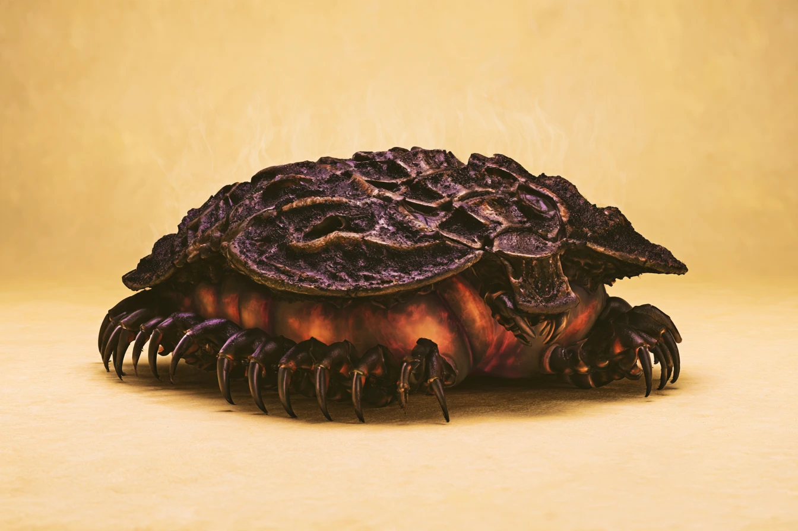
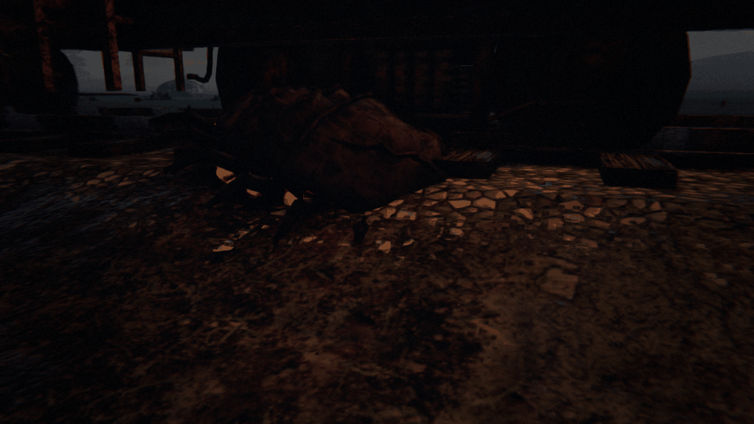
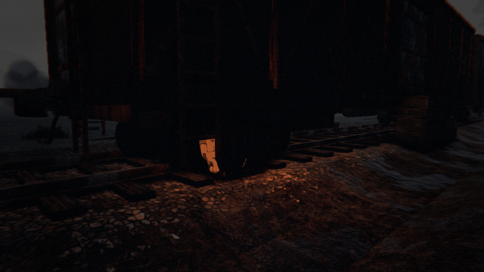
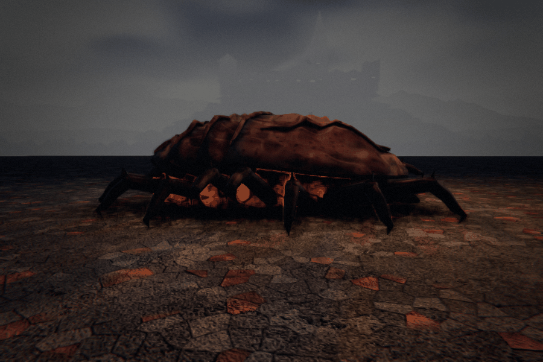

# HOTBOX — an axle parasite that feeds on the train's heat

*Creature design, G1 (enemy design), 8 Oct 2026. **Status: the director's brief of 8 Oct 2026, built overnight (queue
#104, ARCHITECTURE §8 note 367).** Every call the brief left open is taken below and marked **(G1's call)**, for the
director to overrule. Numbers are a first pass in the roster's units (player health 100, a crowbar blow = 1, a gun round
= 4 blows, top speed 22 m/s).*



**As built** (`dt screenshot --view hotboxbug|hotboxout`, `--hotboxbug knock|glow|seized|unfolded|snap|prised`; `dt art
clip hotbox <clip>`): tools/blender/hotbox.py, its colour and its belly's glow baked by tools/models/recipes/hotbox.py; drawn
by Art/CreatureArt.Train.cs. Three masses: a low broad dome of shingled plates (purple-brown, lumped and crusted, each
plate's back edge curled into a lip, ridges curling back over the front shield) wider than the body and overhanging it
all round; under its rim the swollen segmented belly, glowing, seen as bands between the rim and the ground; and eight
thick black legs a side splayed out from under the rim all round, each with a long hooked claw in the ground. The belly,
the head and the legs' roots are one fused skin; the plates, legs and mandibles are hard parts over it. 7,786 triangles,
45 bones. In its truck it's rolled on its side, its back out, the belly dull while it knocks (once a wheel turn), bright
and smoking while it glows, white-hot seized (the seized car's wheel dragging in sparks); at a stand it unfolds half out
onto the ballast (its glow lighting its legs from under the dome), snaps on the sim's beat, and prised, flips out and
runs.





> **Something in the running gear is eating the grease. Listen for the knock, find the wheel, stop the train.**

---

## 1. What it is, and how it differs from the hot box

The upkeep's **hot box** (queue #71, note 331) is a bearing running dry: it squeals, it smokes, it's greased from the
landing in three seconds, and left alone it catches fire. **Hotbox** is a creature that has crawled into a freight car's
wheel truck and lives on what keeps a bearing alive: grease, friction and heat.

| | The hot box (upkeep) | Hotbox (the creature) |
|---|---|---|
| First sign | a dry squeal | **a rhythmic metallic knock tied to wheel speed** |
| Where | the car's rear bogie, both sides | **one truck, one side** (the crew must find which car and which side) |
| Grease | cures it | does nothing (it eats the grease) |
| Left alone | the car catches fire | **the axle seizes and the car drags badly; never fire, never a derailment** |
| The fix | grease, 3 s, at speed | **stop the train**, find it, kill it or prise it out; then repair a seized axle, or abandon the car |

## 2. Roster entry (GDD §21, STRUCTURAL)

**HOTBOX** · *in a freight car's wheels, on the move*
A low, armoured thing the size of a dog folded into a bogie, its belly swollen with heat between black plates.
> **RULE: hear the knock, find the wheel, stop to pull it.**

**Sense:** vibration (the running gear). **Zone:** structural (under a car). **Want:** Cargo (it costs the train a car). **Cost:** 2.

## 3. What it looks like (art brief, GDD §26.5)

From the director's reference: a horseshoe crab's carapace (a low dome of overlapping black armour plates, scorched
purple-brown, ridged and pitted like a casting), a centipede's many legs down both sides ending in hooked black claws,
and between the plates a **heat-swollen abdomen**: segmented, glossy, lit orange-red from inside, the brightest thing on
it. Greasy machinery in its make: plates like brake shoes, joints like rivets, grease and soot in every seam. A short
blunt head under the front plate with mandibles. About 1.1 m long and 0.4 m high: folded into a truck, its plates read
as part of the bogie until it glows.

**Clips:** `clamped` (folded into the truck, plates shut, only the abdomen's pulse), `knock` (a leg hammering the axle
box in rhythm), `glow` (the abdomen swelling bright, steam off it), `unfold` (half out of the truck, legs splayed onto
the rail and the ballast), `snap` (a lunge with the mandibles), `prised` (levered out, flailing), `scuttle` (off into
the dark), `hit`, `death`.

## 4. How it sounds (a request to the audio chat)

- **The knock** (the tell): a heavy metallic knock **once per wheel turn** of its axle (a 0.9 m wheel: 3.5 knocks a
  second at 10 m/s, 7 at 20), from its truck and side. Low and dull, a hammer on a casting, never the hot box's high squeal.
- **The glow**: the knock goes ragged and wet, a sizzle under it, and the bearing's smell is steam.
- **Seized**: the knock stops; a long grinding scrape, the wheel sliding on the rail.
- **Unfolded**: chitin clicking, a hiss when it's struck.

## 5. Behaviour tree (App. A.4 format)

### HOTBOX · vibration
```
BOARD     the train over 10 m/s, out of a fort → it takes a truck (one side) of a car of the engine's rake, never the engine
KNOCK     a knock once per wheel turn from that truck and side, nothing to see
          └ TELEGRAPH: the knock (90 s at 18 m/s; faster the faster you run)
GLOW      the bearing glows and smokes on that side
          └ TELEGRAPH: glow and smoke (90 s more)
SEIZE     the axle locks: the car drags badly (top speed 7 m/s while it's in the train), the wheel slides and screams
          (never fire, never a derailment)
STOPPED   the train stands for 2 s → it half unfolds out of the truck (EXPOSED): legs out onto the rail and the ballast
          ├ killed (6 blows; a gun round is 4) → it falls out of the truck, dead
          ├ prised (Use held 4 s at it, with a crowbar or a wrench) → it drops out and scuttles off for the night
          └ anyone within 1.2 m of its head → SNAP: a bite (30), every 3 s while they stay (it never kills)
MOVING    the train moves again before it's out → it folds back in, the heat where it was
AFTER     a seized axle stays seized once it's out: REPAIR (a wrench, Use held 10 s at the truck) or ABANDON (cut the car)
```

**It never kills** (it bites; App. A.1: only a grab kills). Its danger is the car it costs you, the stop it forces,
and what else comes to a train standing in the dark.

## 6. The social test (§20)

| # | Test | Passes? |
|---|---|---|
| 1 | Describable in one phrase | ✔ "Something in the wheels knocking; stop and pull it out." |
| 2 | Answered better by two | ✔ One listens down each side of the train to find the car and side; one prises while one guards. |
| 3 | Consequence now, death later | ✔ The knock now; the seizure minutes later; the stop and the dark after. |
| 4 | A verb, not just a "don't" | ✔ Listen, walk the train, stop, prise, kill, repair, cut the car. |
| 5 | Someone gets blamed | ✔ The driver who wouldn't stop ("I said it was knocking!"). |
| 6 | Fun to scream | ✔ "IT'S CAR FOUR, LEFT SIDE!" |

## 7. Spawn rules (App. B.4 row)

| Enemy | Spawn context | Gates | Weighting |
|---|---|---|---|
| **Hotbox** | Under a freight car of the engine's rake, after 60 s over 10 m/s | **Every tier** (G1's call: the director's brief puts it in every train's life) · not in a yard or a fort · one at a time · never the engine or the crew car | ×1 Local, ×1.25 Frontier, ×1.5 Dead Lines, ×1.75 Deep Territory; up with the number of freight cars |

## 8. Contradictions (App. B.1 conflict table)

| Pair | The bind |
|---|---|
| **Cinder Hounds + Hotbox** | Run fast to outrun the hounds vs. stop to pull it before it seizes |
| **The hot box + Hotbox** | Grease the squealing box vs. the knocking one isn't a hot box at all (the crew must tell them apart) |
| **Moose + Hotbox** | Stop to pull it vs. stopping beside the Moose's ground |

## 9. First-pass numbers (`enemies.json` `hotbox`)

| Field | Value | Why |
|---|---|---|
| `boardAbove` | 10 m/s | it takes a truck that's turning, not a crawling one |
| `knockSeconds` | 90 | at the reference speed; heat grows by speed / `refSpeed` (18) |
| `glowSeconds` | 90 | after the knock, before it seizes |
| `seizedTopSpeed` / `seizedHold` | 7 m/s / 1.5 | the car drags badly: the train's top speed while it's in the train |
| `exposeAfter` | 2 s | stood still before it unfolds |
| `health` | 6 | blows (a gun round is 4) |
| `priseSeconds` | 4 | Use held with a crowbar or wrench |
| `snapReach` / `snapDamage` / `snapEvery` | 1.2 m / 30 / 3 s | a bite, never a kill |
| `repairSeconds` | 10 | a seized axle, with a wrench |
| `cost` | 2 | |

## 10. What the harness verifies

- `HotboxTests`: it boards only over 10 m/s after 60 s, and never the engine or the crew car; the knock, the glow and the
  seizure by heat; the drag (the train's top speed capped while it's seized); it's exposed only when stopped and folds
  back when the train moves; killed by blows, prised by a held Use; the snap bites but never kills; greasing doesn't touch
  it; a seized axle stays seized until it's repaired or the car is cut; deterministic on the client.
- `SpecTableTests.TheHotboxMatches…` pins the numbers.
- `BotsAnswerTheSixTests` (the bots, note 367): the driver stops once it glows or has seized the axle. A bot gets down
  and prises it out from the side (between its bite's reach and the prise's, so it's never bitten), then frees the
  seized axle with the wrench, and the train goes on. The same with a bot crew over the network.

## 11. Decisions taken overnight (G1's calls, for the director)

1. **Every tier, weighted** (as the Moose and the Gannet); the brief didn't say.
2. **Grease does nothing** to it: that's what tells it from the upkeep's hot box.
3. **Killed or prised**: prising (Use held 4 s with a crowbar or wrench) sends it off alive; killing takes 6 blows.
4. **A seized axle's repair** is a wrench held 10 s at the truck; cutting the car loose abandons it.
5. **It bites when exposed** (30 a bite, never a kill), so pulling it is a two-person job.
