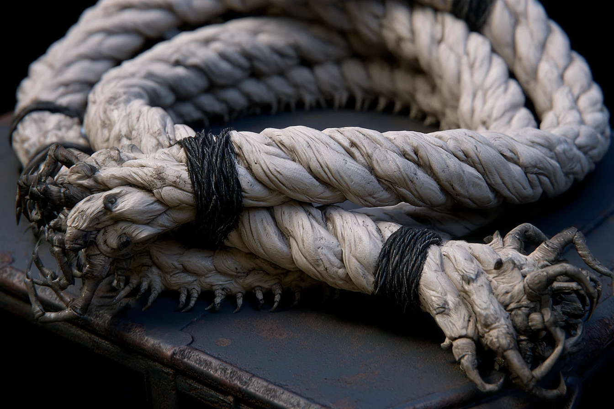
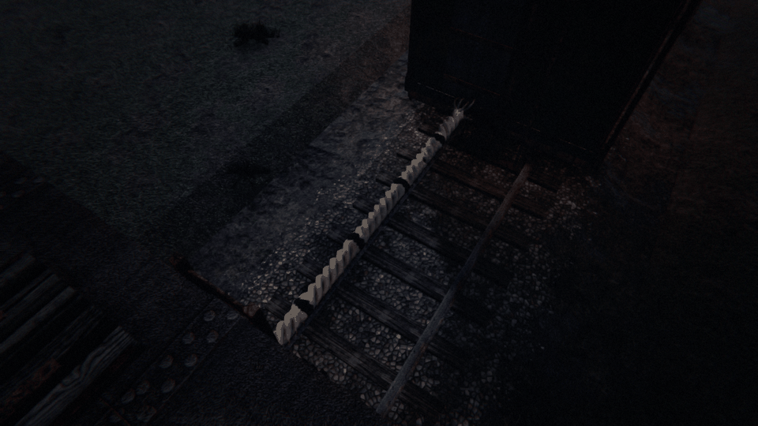
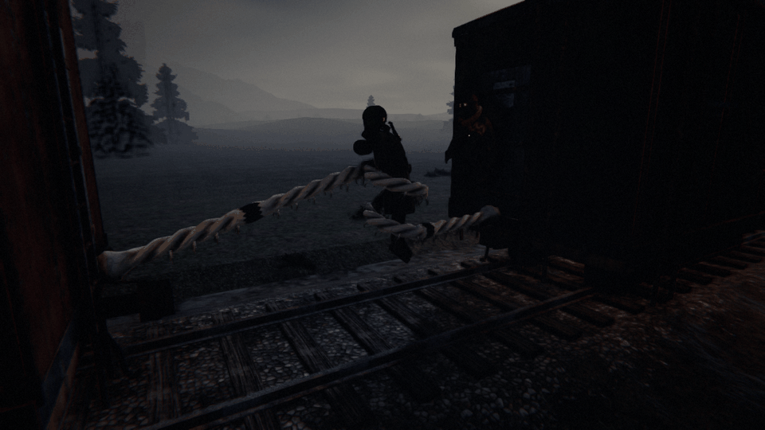
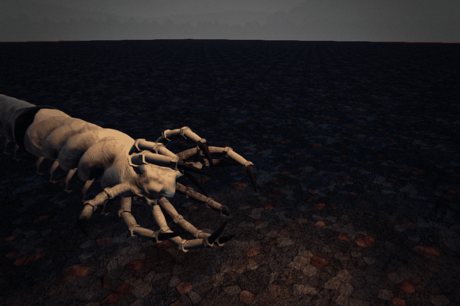

# THE KNOTTER — a rope-bodied parasite that becomes the coupling

*Creature design, G1 (enemy design), 8 Oct 2026. **Status: the director's brief of 8 Oct 2026, built overnight (queue
#102, ARCHITECTURE §8 note 365).** Every call the brief left open is taken below and marked **(G1's call)**. Numbers are a
first pass in the roster's units (player health 100, a crowbar blow = 1, a gun round = 4 blows; a roof jump carries about
2.8 m).*



**As built** (`dt screenshot --view knotter|knotterslip`, `--knotter creep|force|taut|slack|coil`; `dt art clip knotter
<clip>`): tools/blender/knotter.py, its colour baked by tools/models/recipes/knotter.py; drawn by Art/CreatureArt.Train.cs.
The lay (three strands' signed-distance field, their grooves kept), the whipping, the knots and the claws' roots are one
fused skin; the legs and the jointed claws over it. Its 33 segments are laid along the gap as the sim has it forced
(CarShape.Knotted's span): hanging in a U under the coupling while it creeps, straightening as it forces the cars apart,
straight and taut at speed, sagging slack at a stand, and coiled up round whoever slipped. The coupler plate isn't drawn
while it's the coupling.





> **The train is still one train, but now it's held together by something alive, and you can't get across it.**

---

## 1. What it is

A pale parasite like a length of ship's hawser come alive: three strands of grey-white flesh laid up like rope, bound at
intervals with black whipping, and at each end a cluster of hooked, jointed claws. It crawls up into a coupling while the
train runs, grips both cars, forces them apart and becomes the coupling: the train still pulls as one, but the gap is now
far too wide to jump while moving, and the crew is split in two.

## 2. Roster entry (GDD §21, STRUCTURAL)

**THE KNOTTER** · *in a coupling, on the move*
A rope of pale flesh with claws at both ends, holding two cars apart.
> **RULE: don't walk the rope. Stop, kill it, couple up.**

Walking along its back is possible, with a very high chance of slipping under the train. The right answer is to stop the
train, kill it and couple the cars back up.

**Sense:** vibration (the couplings' slack). **Zone:** structural (a coupling). **Want:** Split. **Cost:** 3.

## 3. What it looks like (art brief, GDD §26.5)

From the director's reference: a body thick as a thigh, laid up of three twisted strands of pale grey-white flesh exactly
like a hawser's lay, the strands' ridges worn and dirty; black whipping (tarred twine, or its own dark hide) bound round
it every metre or so; rows of small pale hooked legs along its underside like a centipede's; each end a knot of jointed
grey claws, hooked and grasping, that clamp the cars' end sills. Stretched across a coupling it's 4–5 m long and taut; at
rest it coils.

**Clips:** `creep` (coming up the coupling from under the train, a coil uncoiling), `clamp` (the end claws gripping),
`force` (the body swelling and lengthening, pushing the cars apart), `taut` (held across the gap, the strands creaking
and twisting with the slack), `slip` (a strand rolling under a foot), `coil` (whoever slipped wrapped and dragged down),
`exposed` (slack, writhing, the train stopped), `hit`, `death` (unlaid, the strands springing apart).

## 4. How it sounds (a request to the audio chat)

- **The creep** (the tell): wet creaking, rope under load, at a coupling; the knuckle's clank going wrong.
- **Forcing**: a long groaning stretch and the cars' buffers parting, a jolt down the train.
- **Taut**: the creak of a hawser in a swell, with every change of the train's speed.
- **Exposed**: a dry rattle of claws.

## 5. Behaviour tree (App. A.4 format)

### THE KNOTTER · vibration
```
CREEP     the train over 8 m/s for 30 s, out of yards and forts → it comes up into a coupling of the engine's rake that
          nobody's standing at
          └ TELEGRAPH: the creaking at that coupling, its claws over the plate (4 s); cut the coupling now and it drops
FORCE     it clamps both cars and forces them apart: the gap opens from 1.5 m to 5 m over 6 s; the coupling plate's gone,
          its body across the gap instead
HOLD      the train pulls as one; the gap is 5 m (no jump carries it)
          ├ a crewmate walks its back → each second on it at speed, a chance to SLIP (45% a second over 2 m/s)
          │   SLIP → GRAB: it coils round them, dragging them under (1.5 s): a friend's blow on it, or the victim's own
          │   jump back, frees them → else PUNISH: pulled under the train
          └ blows on it while the train moves don't land (taut, it shrugs them off)
STOPPED   the train stands → it slackens (EXPOSED): its back is safe to walk; blows land
          ├ 8 blows kill it (a gun round is 4) → it unlays, and the cars stand uncoupled where it was (the rear rake's
          │   handbrakes go on, as any cut at a stand)
          └ the train moves again → it pulls taut again
COUPLE    back the engine onto the standing cars (as any coupling) and go on
```

**It kills only by the slip**, through the grab (App. A.1): whoever walks its back at speed is gambling, and a friend at
the gap can save them.

## 6. The social test (§20)

| # | Test | Passes? |
|---|---|---|
| 1 | Describable in one phrase | ✔ "A living rope that holds your cars apart." |
| 2 | Answered better by two | ✔ A driver to stop and couple up; the crew either side to kill it; a friend at the gap to save a slipper. |
| 3 | Consequence now, death later | ✔ The split now; the stop, the kill and the coupling after. |
| 4 | A verb, not just a "don't" | ✔ Cut it early, stop, kill, couple up (or gamble on its back). |
| 5 | Someone gets blamed | ✔ Whoever tried to walk it. |
| 6 | Fun to scream | ✔ "DON'T WALK IT! STOP THE TRAIN!" |

## 7. Spawn rules (App. B.4 row)

| Enemy | Spawn context | Gates | Weighting |
|---|---|---|---|
| **The Knotter** | At a coupling of the engine's rake, after 30 s over 8 m/s | **Every tier** (G1's call) · at least 3 cars · out of yards, forts and tunnels · one at a time · never the coupling behind the engine (G1's call: the cab and its tender stay one) | ×1 Local, ×1.5 Frontier, ×2 Dead Lines, ×2.5 Deep Territory; up with the crew split across the train |

## 8. Contradictions (App. B.1 conflict table)

| Pair | The bind |
|---|---|
| **Cinder Hounds + the Knotter** | Never stop with the pack behind vs. it's killed only at a stand |
| **Car Hugger + the Knotter** | Cut the car the Hugger's on vs. the coupling you'd cut across is the Knotter |
| **Upkeep + the Knotter** | The jobs down the train vs. half the crew can't get to them |

## 9. First-pass numbers (`enemies.json` `knotter`)

| Field | Value | Why |
|---|---|---|
| `boardAbove` / `boardAfter` | 8 m/s / 30 s | |
| `creepSeconds` | 4 | the tell, before it clamps |
| `gap` / `forceSeconds` | 5 m / 6 s | a roof jump carries about 2.8 m |
| `slipPerSecond` / `slipAbove` | 0.45 / 2 m/s | 3 s on its back is about a one-in-six chance of making it |
| `coilSeconds` | 1.5 | the grab's window |
| `health` | 8 | blows, only at a stand |
| `cost` | 3 | |

## 10. What the harness verifies

- `KnotterTests`: it takes a coupling only over 8 m/s, never one with a crewmate at it or the engine's; the gap opens to 5
  m and the train still pulls as one; a jump can't carry it; walking it at speed slips (deterministically, by the tick and
  the player) and the slip is a grab a friend can break; blows only land at a stand; killed, the cars are uncoupled where
  it was; backing the engine couples them up; deterministic on the client.

## 11. Decisions taken overnight (G1's calls, for the director)

1. **Every tier, weighted**; never the coupling behind the engine.
2. **The slip is a grab** (the spine's rule: only a grab kills), with a friend's blow or a jump back to save them.
3. **Killed, it leaves the cars uncoupled** (the brief: "stop, kill it, recouple, continue").
4. **Cut early**: cutting the coupling during its creep (the 4 s tell) makes it drop off; it's a cut, so the rear rake
   rolls free and the crew couples back up.
