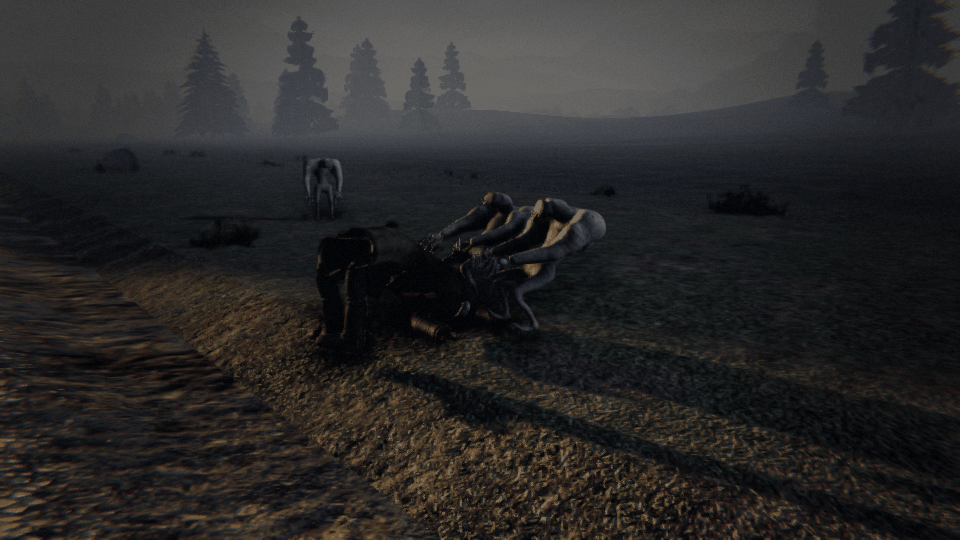
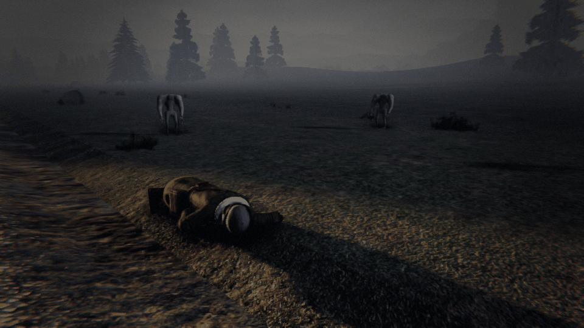
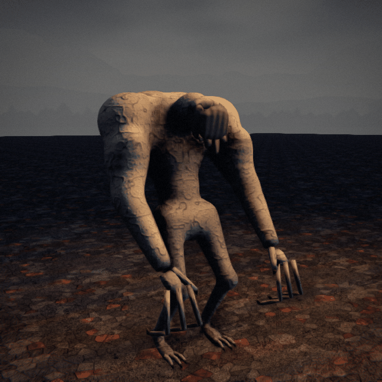

# THE MOURNERS — the ones that come for your dead

*Creature design, G1 (enemy design), 8 Oct 2026. **Status: the director's brief of 8 Oct 2026, built overnight (queue
#99, ARCHITECTURE §8 note 362).** Every call the brief left open is taken below and marked **(G1's call)**. Numbers are a
first pass in the roster's units (player health 100, run 5.5 m/s, a crowbar blow = 1).*

> **Somebody died out here. Now something is carrying them away, and they're worth money.**

---

## 1. What they are

Small, ash-pale scavengers, child-height, that come only after a crewmate dies. They come in a nervous group, like crows
to a carcass: they hang back, edge in, start at every movement, and the moment no one's standing over the body they're on
it, dragging it away from the railway into the dark. They ignore the living entirely. A body brought home pays back most
of what the death cost (`holdouts.json` `bodyRefund`); a body dragged off is gone, and so is the kit it carried.

## 2. Roster entry (GDD §21, OUTSIDE)

**THE MOURNERS** · *wherever a crewmate fell off the train*
A huddle of grey, stooping things with long hooked fingers, picking their way toward your dead.
> **RULE: stand over your dead, or carry them home.**

**Sense:** absence (a death). **Zone:** outside. **Want:** Cargo (the body's worth). **Cost:** 1.

## 3. What they look like (art brief, GDD §26.5)

About 1.2 m tall standing, but they never stand: torsos leaning backward from the hips, as if always hauling on a rope;
**heavy, powerful dragging shoulders** and thick upper arms out of all proportion to the thin legs; **long hooked fingers**,
twice a hand's length, the nails curled; skin ash-pale and dry, cracked like old clay, dusted grey; small heads tucked
low between the shoulders, faces like a mourner's veil of loose skin over the eyes. They move in short, darting runs and
freezes.

**Clips:** `wait` (hunched, rocking, the head turning in jerks), `creep` (a slow bent walk in), `startle` (a jump back,
arms up), `drag` (both hooked hands in the body's clothing, leaning back, heels digging, hauling in tugs), `scatter`
(a darting run off), `hit`, `death`.

## 4. How they sound (a request to the audio chat)

- **Their coming** (the tell): a soft keening, several voices, never in unison, from the dark beyond the body.
- **Dragging**: cloth and gravel, a body's weight hauled in tugs, the keening low and breathless.
- **Startled**: a chorus of dry clicks, then quiet.

## 5. Behaviour tree (App. A.4 format)

### THE MOURNERS · absence
```
DEATH     a crewmate dies and their body lies off the train (on the ground, or in a car cut loose) → after 15 s a
          group comes (3 at Local, 4 Frontier, 5 Dead Lines, 6 Deep Territory) out of the dark, 40 m off, on the far
          side from the line
          └ TELEGRAPH: the keening; pale shapes at the edge of the light
GATHER    they edge in and wait, 6 m from any living crewmate (they never touch the living, never harm them)
          ├ a crewmate comes within 6 m of one → it starts back to 12 m (STARTLE), and edges in again when they go
          └ no crewmate within 6 m of the body → TWO take it and DRAG
DRAG      straight away from the nearest track, 1.6 m/s (a walk; a run catches them), the rest flanking
          ├ a crewmate within 3 m, or a blow on any of them → they drop it and scatter to 12 m; back in 4 s
          ├ one blow kills one (they're frail); each death scatters the rest for 6 s
          └ 120 m from the track → the body's GONE (its refund and its kit with it), and they go
CARRIED   a crewmate picks the body up → they follow at 6 m, waiting for it to be put down
HOME      the body in a car of the train (or the train leaving) → they keen, and go
```

**They never hurt anyone.** Their danger is the money, and what a chase off into the dark leads to.

## 6. The social test (§20)

| # | Test | Passes? |
|---|---|---|
| 1 | Describable in one phrase | ✔ "Grey things that steal your dead." |
| 2 | Answered better by two | ✔ One carries the body, one walks beside to scatter them; or one guards while one fetches. |
| 3 | Consequence now, death later | ✔ The money now; the chase into the dark, where the thing that killed them still is. |
| 4 | A verb, not just a "don't" | ✔ Stand over them, chase, scatter, carry home. |
| 5 | Someone gets blamed | ✔ "Who left Dunmore lying there?" |
| 6 | Fun to scream | ✔ "THEY'VE GOT HIM! THEY'RE TAKING HIM!" |

## 7. Spawn rules (App. B.4 row)

| Enemy | Spawn context | Gates | Weighting |
|---|---|---|---|
| **The Mourners** | Beside a crewmate's body off the train | **Every tier** (G1's call) · only after a death · one group a body · never inside a fort, a building or a car of the train | Their number by tier (3/4/5/6); they cost the director 1, and don't count toward its caps (they hunt no one) |

## 8. Contradictions (App. B.1 conflict table)

| Pair | The bind |
|---|---|
| **The Gaunt + the Mourners** | The body's worth chasing vs. the Gaunt that took one in the first place is out there |
| **Ribbits + the Mourners** | Chase them off alone vs. never be alone off the train |
| **The Moose + the Mourners** | Run after the body vs. running is what the Moose charges |

## 9. First-pass numbers (`enemies.json` `mourners`)

| Field | Value | Why |
|---|---|---|
| `after` | 15 s | after the death |
| `count` | [3, 4, 5, 6] | by tier |
| `arriveAt` | 40 m | off the body, away from the line |
| `shy` / `startleTo` | 6 / 12 m | crows at a carcass |
| `dropWithin` | 3 m | a crewmate this close makes them drop it |
| `drag` | 1.6 m/s | a walk; a run (5.5) catches them |
| `returnAfter` / `scatterOnDeath` | 4 / 6 s | |
| `lostAt` | 120 m | from the track, the body's gone |
| `health` | 1 | a blow each |
| `cost` | 1 | |

## 10. What the harness verifies

- `MournersTests`: none come without a death; they come after it, by tier; they never come near the living or harm
  anyone; they drag only when no one's over the body, straight away from the line; a crewmate close or a blow makes them
  drop it and scatter; a blow kills one; a body carried is followed, not touched; 120 m out the body and its refund are
  gone; a body home sends them away; deterministic.

## 11. Decisions taken overnight (G1's calls, for the director)

1. **Every tier**; their number by tier.
2. **They never harm the living** (the brief: "they ignore the living").
3. **A blow kills one** and scatters the rest; they come back until they're all dead or the body's home.
4. **The body's lost at 120 m** from the track: its refund and the kit it carried with it.

## 12. As built (art and presentation, G1.6, 8 Oct 2026)





- **Model** (`tools/blender/mourner.py`, SK_Mourner, 37 bones): one continuous skin from the feet to the brow (smooth
  volumes settled onto their blended field, `tools/blender/flesh.py`, then `rig.fuse`'s QuadriFlow): a small pelvis,
  the starved waist, the ribs' cage leant back over it, the great hump of the shoulders and bunched upper arms, thin
  knobbed legs, the small skull pushed forward low between the shoulders, the brow, and the veil: a curtain of the face's
  own loose skin hanging over the eyes with a few ragged rags off its hem (they sway on the veil bone). Over it: three
  thin, two-boned hooked fingers and a thumb a hand, twice the palm's length, the nails curled under; three clawed toes; wet
  black glints of eyes at the veil's edges. **6,116 triangles** (distance copy 2,446), stooped to 1.0 m.
- **Colour** (`tools/models/recipes/mourner.py`, one 2048 atlas): ash-pale, dry, crazed like old clay (the cracks baked
  into the normal map and darkened, a pale lifted rim along each), grey dust on whatever faces up, bruised grey-violet
  at the joints, grimed lower down and along the fingers; the veil darker and sallow; the nails dark horn.
- **Clips**: wait (rocking, the head snapping round in holds), creep, startle (a jump back, arms flung up), drag (both
  hands hooked at the sim's hold, `holdAt` / `holdHeight`, leant back, heels dug in, hauling in lurches), scatter, hit,
  death (over backward, knees up, hands curled). `dt art clearance --only mourner`: clean.
- **In the game** (`CreatureArt.Outside.cs`): each one faces its heading and plays the clip for its `MournerMode`
  (Come and Leave scatter; Wait shifts to a creep when it's moving in its ring; Startle jumps back then waits), each its
  own size and time by its id. The dragged body is the sim's (`Bodies.TakeAlong`). Cues: the group's lead's coming and
  its taking the body. `dt screenshot --view mourners` (or `--mourners drag|wait|creep|startle`).
