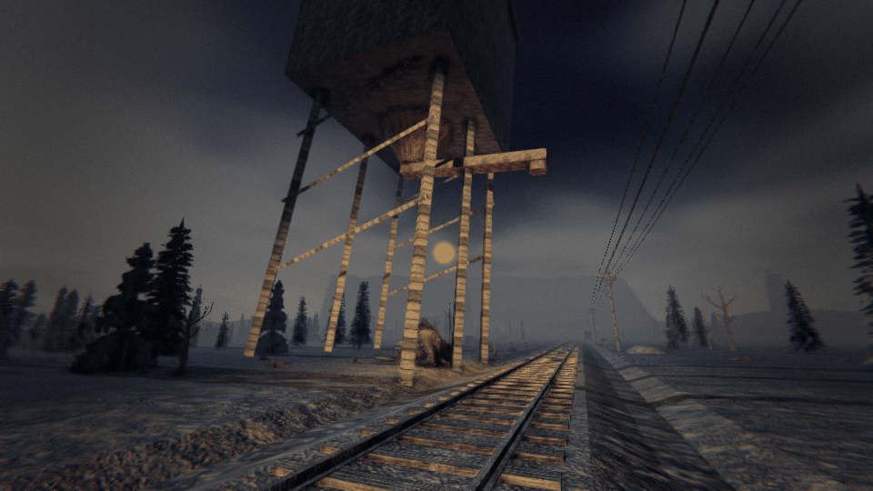
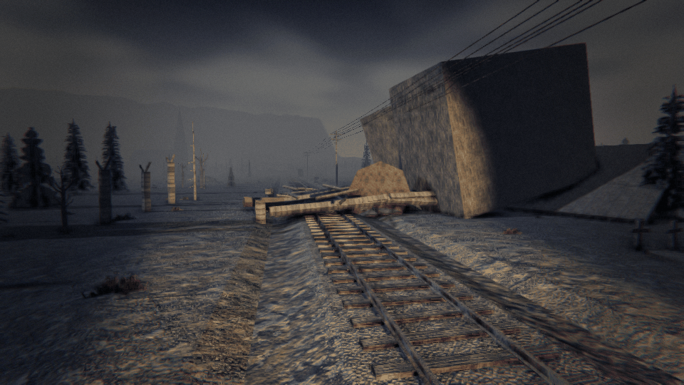
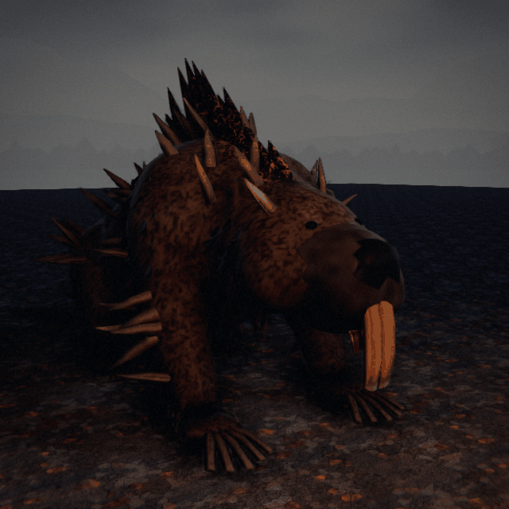
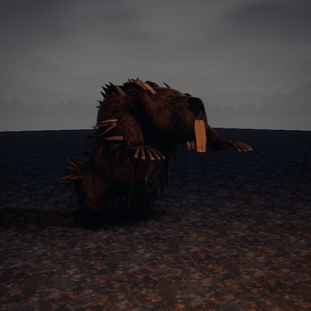

# TOWER JAW — a corrupted beaver that fells the railway

*Creature design, G1 (enemy design), 8 Oct 2026. **Status: the director's brief of 8 Oct 2026, built overnight (queue
#100, ARCHITECTURE §8 note 363).** Every call the brief left open is taken below and marked **(G1's call)**. Numbers are a
first pass in the roster's units (player health 100, a crowbar blow = 1, a gun round = 4 blows).*


> **Listen. Something's chewing on the water tower.**

---

## 1. What it is

A beaver the size of a bear, grown huge on the railway's timber. It gnaws through the supports of the line's wooden and
light structures (water towers, coaling towers, loading gantries, signal frames) the way a beaver fells a tree, and it
never stops till the thing comes down. Caught early it can be driven off or killed. Ignored, the structure collapses
across the line or the facility: a heap of timber and iron the crew must clear by hand, work around, or abandon. It never
touches a bridge.

## 2. Roster entry (GDD §21, OUTSIDE)

**TOWER JAW** · *at the stops, under the railway's timber*
A beaver as big as a bear, its hide bristling with splinters, gnawing at a tower's legs with iron-dark teeth.
> **RULE: hear the chewing, find the tower, get it off before it falls.**

**Sense:** vibration (feet on the ground and the structure). **Zone:** outside (stops). **Want:** Cargo (it costs the
train a stop's service). **Cost:** 3.

## 3. What it looks like (art brief, GDD §26.5)

From the director's reference: a beaver's body, front-heavy, **enormous hunched shoulders** standing higher than its
head; a blunt wet muzzle and black nose; **iron-dark industrial incisors**, two great chisels as long as a forearm, chipped
and rust-streaked; dark brown fur matted wet and slicked into spikes, **the hide filled with splinters** (shards of
timber driven through it everywhere, and a ridge of black splintered wood like spines down the back, glowing ember-red
in the cracks); **shovel paws**, broad, their claws like split planks; a broad flat scaled tail. About 1.6 m at the
shoulder.

**Clips:** `gnaw` (side-on at a post, the head working, chips flying), `turn` (head up, listening), `threat` (rearing,
the incisors bared, the tail slapping the ground), `lunge` (a short charge and a bite), `retreat` (a heavy lope off),
`hit`, `death`.

## 4. How it sounds (a request to the audio chat)

- **The gnawing** (the tell): a deep, rhythmic chiselling, wood splitting in chunks, carrying a long way at a stop.
- **The structure**: creaks, then a groan as it leans; the last warning a crack like a shot.
- **The tail slap**: a flat, heavy whack on the ground (its threat).

## 5. Behaviour tree (App. A.4 format)

### TOWER JAW · vibration
```
GNAW      at a stop with a wooden or light structure (not a bridge) → it's gnawing one of its supports when the train
          comes; the structure's strength falls (it comes down in 150 s of gnawing; faster at harder tiers)
          └ TELEGRAPH: the chiselling; chips; then the creak and the lean (from half gnawed), the groan (the last 5 s)
NOTICE    a crewmate within 10 m → it turns, rears and slaps its tail (THREAT, 1.5 s)
          ├ they come within 3 m → LUNGE: a bite (35, never a kill); then back to the post
          └ they back off → back to gnawing
HIT       blows: 4 in 15 s DRIVE IT OFF (it lopes away for 120 s, then comes back to the same post, its gnawing kept)
          12 blows kill it (a gun round is 4)
COLLAPSE  the support gnawed through → the structure falls across the track beside it or the facility:
          ├ anyone under it takes a crushing blow (45, never a kill)
          └ the wreckage BLOCKS that track there (a train that hits it is damaged and stopped, as any collision)
CLEAR     the crew clears it by hand: Use held at the wreckage, 30 crew-seconds (two do it in 15), or works round it
          (another track through the yard), or abandons it (the coaling tower's chute, the crane: gone for the night)
NEVER     a bridge; it never boards the train
```

## 6. The social test (§20)

| # | Test | Passes? |
|---|---|---|
| 1 | Describable in one phrase | ✔ "A giant beaver chewing down the water tower." |
| 2 | Answered better by two | ✔ One draws its threat while another hits it; clearing wreckage goes twice as fast with two. |
| 3 | Consequence now, death later | ✔ The chewing now; the blocked line later. |
| 4 | A verb, not just a "don't" | ✔ Find it, drive it off, kill it, clear, go round. |
| 5 | Someone gets blamed | ✔ "Didn't anyone hear it CHEWING?" |
| 6 | Fun to scream | ✔ "IT'S COMING DOWN! GET OUT FROM UNDER!" |

## 7. Spawn rules (App. B.4 row)

| Enemy | Spawn context | Gates | Weighting |
|---|---|---|---|
| **Tower Jaw** | At a stop's wooden or light structure, gnawing when the train comes | **Every tier** (G1's call) · only a stop with such a structure · never a bridge · one at a stop | ×1 Local, ×1.5 Frontier, ×2 Dead Lines, ×2 Deep Territory; ×2 beside water (lakes, rivers: beavers) |

## 8. Contradictions (App. B.1 conflict table)

| Pair | The bind |
|---|---|
| **The Moose + Tower Jaw** | Crowd the beaver to drive it off vs. crowding is what the Moose minds |
| **Facility loading + Tower Jaw** | Load and go vs. the coaling tower's coming down |
| **The Whistler + Tower Jaw** | The chewing's loud: you can't hear the Whistler's call over it |

## 9. First-pass numbers (`enemies.json` `towerJaw`)

| Field | Value | Why |
|---|---|---|
| `gnawSeconds` | [150, 120, 100, 90] | by tier |
| `leanFrom` / `groanSeconds` | 0.5 / 5 s | the tells |
| `notice` / `lungeWithin` | 10 / 3 m | |
| `threatSeconds` | 1.5 | |
| `bite` | 35 | never a kill |
| `driveOffBlows` / `driveOffSeconds` / `awaySeconds` | 4 blows / 15 s / 120 s | |
| `health` | 12 | blows |
| `crush` / `crushRadius` | 45 / 3.5 m | as the wreck heap |
| `clearCrewSeconds` | 30 | crew-seconds of Use at the wreckage |
| `cost` | 3 | |

## 10. What the harness verifies

- `TowerJawTests`: it gnaws only a wooden or light structure, never a bridge; the strength falls to the collapse; the
  threat and the lunge (never a kill); 4 blows drive it off and it comes back to its post with its gnawing kept; 12 kill
  it; the collapse crushes (never kills) and blocks the track there; a train stops against it; the crew clears it with
  Use, faster with two; deterministic.
- `BotsAnswerTheSixTests` (the bots, note 489): bots on foot drive it off its post and are never killed; gnawed past
  0.9, they keep clear of the fall. The driver stops short of its wreck, the bots clear it, and the train goes on with
  the crew aboard.

## 11. Decisions taken overnight (G1's calls, for the director)

1. **Which structures**: those the stops have as things in the world: the water tower, the coaling tower and the
   loading crane's gantry. Signal frames don't exist yet; they join when they do.
2. **Every tier**, faster gnawing at harder tiers; more beside water.
3. **The wreckage is cleared by hand** (Use held, 30 crew-seconds), and blocks the track until then.
4. **It bites but never kills**; driven off, it comes back to finish the job.

## 12. As built (art and presentation, G1.6, 8 Oct 2026)






- **Model** (`tools/blender/tower_jaw.py`, SK_TowerJaw, 26 bones): one fused skin from the rump through the barrel of
  the chest, the hump of the shoulders standing over the head, the thick neck, the big blunt head (a broad flat skull,
  puffed cheeks, a heavy rounded wet muzzle, flews, a big black nose, small round ears), the bear's forelegs down to
  broad shovel paws, the folded hind legs on webbed feet and the tail's root out to its broad flat paddle, held up off
  the ground so its scaled top shows from the side. Over it: some 540 wet fur clumps slicked into spikes (combed back and
  down the way the fur lies, hanging under the belly), 80 timber splinters driven in at all angles, a ridge of black
  splintered spines from the nape to the rump (tallest over the hump), two broad flat chisel-ended incisors as long as a
  forearm hanging well below the lip, plank claws, small black eyes high on the skull. **15,528 triangles** (distance
  copy 6,199), about 1.6 m at the hump
  and 2.2 m to the spines' tips.
- **Colour** (`tools/models/recipes/tower_jaw.py`, one 2048 atlas): dark brown soaked fur with lighter clump tips and black
  hollows, charred round the spines' roots; the spines black char split by cracks that glow ember-red (an emission map);
  the incisors orange-brown (a beaver's, stained: G1's review), darker streaks run down them, paler at their chipped
  chisel ends; dark wet muzzle and paws, a black
  glistening nose; a dark scaled tail; weathered splinters pale where they snapped; old dark timber claws.
- **Clips**: gnaw (side-on, the head turned to the post and wrenching, the jaw working; chips fly), turn (head up,
  listening), threat (reared, incisors bared, the tail raised and slammed flat), lunge, retreat (a humping lope), hit,
  death. `dt art clearance --only tower_jaw`: clean.
- **In the game**: the sim keeps it at its jaws (`gnawAt` off the leg), so its body's drawn `TowerJawBack` (0.85 m) back
  of that. Threat starts with the turn; Lunge plays once then the threat. **The structure**: the coaling tower now stands
  on three stilts a side, its near middle one at `towerLegOut` (now 3.5 m, the drawn stilt; was 2.6) is the one it gnaws.
  From `leanFrom` gnawed the tower leans over the line about its near feet, more as it goes (up to about 9°), shuddering
  its last few percent (`CreatureArt.TowerLean`); in Wreck the standing tower is hidden and the creature is drawn as the
  wreck across the line at its spout (`StructureKit.CoalingTowerFallen`); once cleared (the creature gone) the scene keeps
  it down with its heap dragged off the rails. Cues: the chiselling, its threat, driven off, the tower down.
  `dt screenshot --view towerjaw` / `towerjawfall` (or `--towerjaw gnaw|lean|threat|lunge|away|wreck`, on a generated
  night with a coaling tower, frontier:3 unless `--route` says).
- **Not yet**: the loading crane's gantry doesn't lean or fall (the crane's `Wrecked` only stops it); the cleared state is
  the scene's memory, so a client joining after the clearing sees the tower standing.
