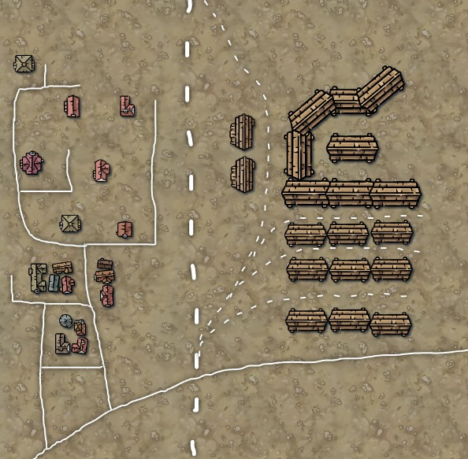

# DARK TERRITORY — LEVEL DESIGN PRINCIPLES
## Companion to GDD v1.0 · September 2026 · living document, one example at a time

This document turns hand-drawn example levels into **rules a generator can follow at any scale**. Each example gets a breakdown: what's on the page, why it works in terms of the GDD, and the generator rule it implies. Part Z collects the rules that hold across examples. As more examples arrive, rules that hold get promoted to Part Z, and rules that one example contradicts get split into per-archetype variants.

Numbers here are **first-pass readings of a sketch**, not tuning. Once a generator implements a rule, its number moves into `content/tuning/*.json`, and that file cites this section (CLAUDE.md: "design numbers live in tuning").

**Conventions.** Everything is placed in the **rail frame**: `s` is distance along the main line in metres, `d` is lateral offset in metres (+ right of travel direction). This is the frame `RouteGenerator` and `WorldArt` already use, and it is the only frame that stays meaningful on a line of unbounded length.

---

# EXAMPLE 1 — THE LOADING YARD



*Solid lines are roads, dashed lines are track. The timber buildings on the right are storage sheds holding crates and bulk loot, with gantry cranes over the sidings. The plaster buildings on the left are houses in a long-abandoned village, sometimes still holding small hidden loot (medicine, treats, valuable tools).*

## 1.1 Reading the scale

The sketch has no scale bar. **Read it at about 0.5 m per pixel**, so the page is about 300 m square. This is the reading that keeps the existing numbers true:

- A storage shed (~55 px) comes out at ~27 m, about two cars (`train.json` carLength 14).
- A siding row of three sheds comes out at ~90 m, about the engine plus four cars. That matches `facilities.json`/`route.json` spurLength 100 and GDD §17: "most cannot accommodate a full armoured freight train".
- The village sits 40–105 m off the main line. `WorldArt` already scatters villages 38–68 m out.
- The yard's farthest shed is ~150 m from the throat, mid-range on spec D.1's Compact (60 m) → Sprawling (400 m) scale.

At 1 m/px a siding would hold ten cars and the split-consist problem would disappear, so that reading is rejected.

## 1.2 Inventory

| Element | What's drawn | Rail frame (approx.) |
|---|---|---|
| **Main line** | One straight track through the whole page | `d = 0`, `s` ∈ [0, 290] |
| **Yard throat, south** | A single lead diverging from the main, fanning into the sidings | toe at `s ≈ 70`, `d` 0 → +60 |
| **Yard lead, north** | A second lead that curves in from the north and joins the top of the yard | `d` +10 → +60 |
| **Sidings** | ~4 parallel dead-end sidings, perpendicular-ish to the main after the fan | `d` +60 → +145 |
| **Storage grid** | 4 rows × 3 sheds, rows alternating with sidings | `d` +60 → +145 |
| **Hero cluster** | 5 sheds joined in a chevron that follows the north lead's curve, plus 1 standalone | far end of the yard, `d` +65 → +130 |
| **Throat sheds** | 2 small sheds on the inside of the north lead, between the main and the yard | `d ≈ +35` |
| **Village** | ~15 houses in 4 road-bounded blocks, stacked along the line | `d` −40 → −105 |
| **Frontage road** | A village road running parallel to the main, ~20 m off it | `d ≈ −20` |
| **Level crossing** | The one place a road crosses the main line | south edge, `s ≈ 20` |
| **Through road** | Road from the SW corner, over the crossing, off the east edge | leaves the page both ways |
| **Outliers** | A lone building at the end of a stub road (NW); a grey-green square-roofed type, of which there are two | `d ≈ −105` |
| **Village edge sheds** | Timber outbuildings on the village side, nearest the rail | `d ≈ −25` |

## 1.3 Principles

Each principle below gives what the sketch does, why it works (with its GDD/spec basis), and the generator rule it implies.

### P1 — Different loot logic, different place
**Sketch:** industry on one side, homes on the other, the main line between them.
**Why:** the two halves ask for different crews doing different things at the same time, so the site splits the crew by design (GDD §17: "several isolated pieces"). A crew can't do both halves together. It has to choose, or split.
**Rule:** **districts are independent pieces a stop is assembled from.** A stop is a yard alone, a village alone, or both. When it has both, they are kept apart: on opposite sides of the main line (as here), or the village set back or further along, joined by a road. Whichever it is, getting from one to the other is a deliberate walk away from the train. *(Answered: the village doesn't have to be opposite the yard or attached to it.)*

**Consequence worth keeping:** by GDD §17 the loaded cars wait on the main line while the engine works the yard. In the opposite-sides arrangement that means **the parked half-consist sits between the yard and the village**. Anyone going to the village has to pass it, climb over it or go round it, and anything hiding in it is between them and the engine. The generator doesn't place this. It falls out of P1 plus the existing split-consist rules, so it's free.

### P2 — The portability gradient
**Sketch:** crane loot sits right on the track. Hand loot is 40–105 m away across open ground.
**Why:** it matches loot to the tool that moves it. Heavy loot needs the train brought to it (switches, spotting, a 2-player crane: spec D.2's *blind instruction* failure). Light loot needs people taken to it (distance, isolation, *being left behind*: GDD §23). Different kinds of loot fail in different ways, which is spec D.3's intent applied across a whole site rather than within one module.
**Rule:** **value per kilogram rises with distance from track; mass falls.**
- Band 0, on the track (`|d|` < crane span): uncarryable. Loading needs a module (crane, winch, chute).
- Band 1, the flanks (`|d|` < ~40 m): two-person and one-person crates (`facilities.json` crates, heavy crates).
- Band 2, off-rail (`|d|` > ~40 m): pocketable. Medicine, treats, tools. Found by searching, not by loading.

A site rolls its loot *by band*, and nothing uncarryable is ever placed beyond crane reach of a siding.

### P3 — The train goes to heavy loot; people go to light loot
**Sketch:** the yard's leads and sidings reach every shed. No track goes anywhere near a house.
**Why:** the train is the only thing that can carry bulk, and it's also the only safety (GDD pillar 1). Wherever bulk loot is, the engine has to be there too. Wherever light loot is, the engine isn't. So each site's layout already answers "who's near the engine tonight?"
**Rule:** every storage building is **within crane reach of at least one siding**. Every lootable house is **off the rail network**.

### P4 — Planned vs grown: the silhouette tells you what kind of place it is
**Sketch:** the yard is a strict grid, every shed square to its siding. The village is scattered and irregular: every house turned a little, footprints mixed (rectangle, L, cross, cluster).
**Why:** art pillar 1 (readability through silhouette) and pillar 3 (shouting). In the dark, from the cab, a row of long identical roofs means "cranes, crates, the train goes in there". A jumble of small roofs means "go on foot and search". The layout itself tells the crew what to do.
**Rule:** **industrial districts are laid out on the track's axes; domestic districts are jittered off them.** Parameters: yard yaw jitter 0°; village yaw jitter ±25° (the existing village code's ±0.4 rad is a match); a mix of footprint types per village, with no single type above ~40%.

### P5 — Double-loaded sidings
**Sketch:** sidings and shed rows alternate, so most sheds touch a siding on one side and many touch one on both.
**Why:** one crane over one siding serves the sheds on both sides. Choosing *which siding to spot the train in* is the yard's decision: each siding offers two rows of loot, and every siding needs its own set of switches thrown.
**Rule:** a storage grid is `N` sidings (2–6, spec D.1) at a pitch of **track, shed row, track, shed row…**. Row depth ≈ crane span minus clearance, so a gantry astride a siding (`facilities.json` crane.span [−3.5, 9]) reaches halfway into each flanking shed. The outermost rows may be single-loaded (a wall on the far side).

### P6 — One throat
**Sketch:** every siding branches off one short ladder next to the main line, so all the yard's switches are in one small area.
**Why:** it gives the site one point where ground exposure is concentrated (GDD §17: "someone is on the ground at every junction, alone, calling the route"). Everyone who works the yard passes through the throat, so it's the place to put the tension. It also makes switch calls shoutable: "third road off the ladder" (pillar 3).
**Rule:** a yard has **one throat per lead**, and **1–2 leads**. A second lead makes the yard a loop the engine can drive through without reversing. That's this sketch's choice, not a rule, so the generator rolls it. The switches are packed into one ladder, about 22 m of it per siding (one siding pitch), and there's no switch anywhere else in the yard. **0–2 small auxiliary buildings** may stand at the throat for variety (in the sketch, the two sheds on the inside of the north lead). They're a natural home for the yard office or power (spec D.1: the dead-facility restart excursion).

### P7 — Depth: the far end is the prize
**Sketch:** the regular grid gives way at the far end to a chevron of joined sheds plus a standalone shed, larger and irregular, reached along the curving north lead.
**Why:** it rewards going deeper, and distance from the throat and the main line is exactly what makes a thing dangerous to fetch (more switches, longer reverse out, further from the parked cars). A single hero structure also gives the whole yard a silhouette.
**Rule:** loot value inside a district **increases with graph distance from the throat** (switches thrown + metres of track). Each yard has **one hero structure at its deepest point**, and it breaks the grid.

### P8 — Buildings follow the track, never the reverse
**Sketch:** the chevron is what a shed row looks like when its siding curves. The sheds bend to the north lead's arc.
**Why:** track geometry is constrained (turnout radii, `route.json` spurRadius 150, divergeRadius 190) and buildings aren't. If the track is laid first and the buildings fitted to it, curvature limits never have to be negotiated.
**Rule:** **generation order is rail → roads → buildings → loot.** Industrial buildings are placed as segments tangent to their siding. A curved siding produces a chain of short sheds, each rotated to its local tangent.

### P9 — Two networks: rail serves industry, roads serve people
**Sketch:** the roads make the village's blocks, run a frontage road beside the line, end in stubs at outliers, cross the main line exactly once, and run off the page in both directions. The yard has no roads of its own.
**Why:** the roads are older than the collapse and belong to the village. The rail is what still works. Keeping the two separate stops the yard and the village merging into one mush. Roads that leave the page are what make a site feel like part of a world rather than a room.
**Rule:** roads are generated **as their own network, at a coarser scale than sites** (see Z.3). A site doesn't invent its through road; it inherits it from the regional road net and hangs its village off it. Roads never run *into* a yard.

### P10 — The level crossing is the hinge
**Sketch:** the one road–rail crossing is at the south end, next to the yard's south throat and the densest village block.
**Why:** it's where the two halves meet. It's the shortest safe-feeling route between them, a name everyone can shout ("meet at the crossing"), and the obvious path that creatures and players alike will use. That makes it a natural place for an ambush or a Sleeper (App. B.2).
**Rule:** a stop with districts on both sides of the main line has **exactly one level crossing**, placed **within ~60 m of a yard throat**. The village's densest block is placed next to it. A one-sided stop may have a crossing (the through road still has to get somewhere) but doesn't need one.

### P11 — Village anatomy
**Sketch:** four blocks, each bounded by roads, 2–5 houses per block. The densest cluster is at the road junction nearest the crossing. Lone buildings stand at the ends of stub roads. Timber outbuildings sit on the village's rail-facing edge.
**Why:** the density gradient gives the search an order: the obvious, picked-over houses near the road first, the lonely ones last. The outliers are where a scavenger crew *hopes* the good stuff is, and they're the furthest from the engine. The timber edge sheds share a material with the yard, so the gradient from industrial to domestic stays readable.
**Rule:**
- Blocks are road-bounded, 2–5 houses each, 3–5 blocks per village.
- Density falls with distance from the crossing and the through road.
- **Each village gets 1–2 outliers**, reached by stub roads or open ground. Outliers get **higher loot odds and a better quality roll**.
- The houses nearest the rail are small outbuildings in timber. Plaster is further out.
- **Setback:** no house within ~20 m of the main line (the frontage road runs in that gap).

### P12 — Certain-but-costly vs uncertain-but-quiet
**Sketch/brief:** the yard's loot is *there*, crated, visible. The village "sometimes still has loot", hidden.
**Why:** the two halves carry different risks. The yard is a known payout paid for in noise (cranes are "slow, loud": GDD §17), coordination and switch exposure. The village is a gamble paid for in distance and time. A crew that's losing the dawn race (GDD §8) takes the certain one. A crew that's ahead takes the gamble. Either way it's a decision, not a chore (GDD §18: "the payout exists to force bad decisions").
**Rule:**
- Yard loot is **deterministic and visible on arrival** (crate counts shown on shed doors or through the doorways).
- Village loot is **probabilistic and hidden**. Per house, roll whether it holds anything (~30–40%); then roll hiding spots within it (under floorboards, behind a wall panel, in a cellar) that take time to search.
- **Floor guarantee:** each village holds at least one find. Otherwise a crew that spends the excursion and finds nothing learns never to go again, and the village becomes scenery.

### P14 — Where is authored; what is economic
**Brief:** loot spawns in sensible locations, but what it is comes from the run's economy. House colours in the sketch are just variety.
**Why:** placement is level design and contents are balance. Keeping the two separate lets the economy (spec F) be tuned without touching a single layout, and keeps every find believable: medicine in a bathroom cabinet, tools in an outbuilding, a crate in a shed bay under the crane.
**Rule:** the layout generator places **loot containers** with a *kind* (shed bay, crate stack, cupboard, cellar, under-floor, outbuilding bench). It never places items. At run start the economy turns the run's budget into item rolls and fills containers by kind. A container's kind limits what may go in it; the run's budget decides how much.
**Every yard line (the director, 8 Oct 2026; ARCHITECTURE §8 note 352):** "Loot should spawn in all yard lines in early game and mid game." On local, frontier and dead-lines yards, every siding has a container beside its loading face (its own crane bay, or a crate stack on its side of a shed it stands beside); a crew that pulls into any line finds something to load. Deep territory is left to its dice (its bigger stock left none bare in 40 yards). And a stop's loot is out before the train is near enough to see it, never appearing once the crew has stopped.
**Open houses (GDD App. F.3; ARCHITECTURE §8 note 326):** every village house stands open, a door in the face toward the line (each of a pair's cottages has its own; an L or a cross is one floor, its parts open into each other). A find in one lies inside where it was kept: at the foot of a cupboard on the back wall or a cabinet on a side wall, on the cellar's hatch, on a run of prised-up boards. What's kept in an open house isn't there to see until it's been searched: a crewmate stands at the cupboard, cabinet, hatch or boards empty-handed and holds Use for a couple of seconds (a cabinet) to five (the boards), and what it held comes out (loot.json `search`). Whether to split up for the village, work the yard together or take the village together is the crew's call, and the village costs the time it takes to go in. A plain house's spots take one crewmate about ten seconds; a village of them, a few minutes alone and less split up.

### P13 — The gap is the danger
**Sketch:** about 20–40 m of open ground between the rail and each district, with no buildings in it.
**Why:** open ground is exposure. The walk from the parked consist to the first house is when "the engine can leave without you" (GDD §17) is felt most, because you can see the train and it's too far. It also keeps the line clear for the train (collision, sightlines).
**Rule:** a **no-build buffer** either side of the main line (~20 m from the rail to the first house; sidings and their sheds are exempt on their own side). Cover in the buffer is sparse and deliberate: a handful of props, never a building.

---

# PART D — DIFFICULTY AND VARIETY

The brief after Example 1: layouts need more variety, early runs need to be easier, and later runs need to be harder. This part says what makes a stop hard to work, how the generator scales it by route tier (GDD §11), and how it guarantees the result. All numbers are first-pass. They move to `content/tuning/` with the generator.

## D.1 What makes a stop hard

Difficulty is **what the crew physically has to do to load**, counted move by move. Everything below makes one or more of those counts bigger:

| Count | What drives it |
|---|---|
| **Trips into the yard** | Empties to fill ÷ siding capacity. The consist grows with tier while sidings get shorter (P16). |
| **Switch throws on foot** | Switches on each route × trips, plus two more for every blocked siding that has to be cleared. |
| **Couplings** | Two per trip (uncouple the cut, couple it back). |
| **Reversals** | One per trip with facing points, two with trailing points (pass the throat, back in), plus one per clearance. A loop needs none in the yard; the one it costs is on the open main (P17). |
| **Blind moves** | Moves with cars ahead of the engine. Trailing points turn every crane spot into a blind spot, called by shouted distance (P17). |
| **Crane re-spots** | Cars per trip ÷ cars under the runway. Shorter runways mean more re-spots (P18). |
| **Cars loaded by hand** | Cars filled at a siding with no crane: slow, loud and exposed (P18, spec D.2 manual crates). |
| **Hard pulls** | Trips that drag loaded cars up a grade of 2% or more out of the yard (P18, spec D.1 spur grade). |
| **Metres on foot** | The switchman's walks from the waiting cars to each route's switch and back, the walk to the powerhouse when power is low or dead, and the village round trip (P19). |
| **Blocked crossing** | The waiting cut of loaded cars sits across the level crossing, so everyone climbs through it (P19). |

The score is a weighted sum: throws ×1, couplings ×0.5, reversals ×1.5, blind moves on a curve ×2.5 (on the straight ×1), blind spots ×1.5, re-spots ×0.6, cars by hand ×2.5, clearances ×5, hard pulls ×0.9 per % of grade, 1 per 80 m walked, 2 for low power and 5 for dead, 3 for a blocked crossing. A village adds its round trip (1 per 50 m), 3 ÷ the tier's find odds, 0.15 per house to search and 1 per 25 m it sits off the line. That village part counts at 0.4 on a stop that also has a yard, because the village is optional there.

## D.2 The levers, by tier

| Lever | Local | Frontier | Dead lines | Deep territory |
|---|---|---|---|---|
| Consist (spec F table) | 3 cars | 8 | 15 | 20 |
| Empties to fill (half, the departure load) | 2 | 4 | 8 | 10 |
| Yard forms | spur 45%, loop 40%, fan 15% | spur 15%, loop 25%, fan 40%, parallel 20% | loop 10%, fan 35%, parallel 35%, split 20% | fan 30%, parallel 35%, split 35% |
| Sidings | 1–2 | 2–4 | 3–5 | 4–6 |
| Siding holds | 5–7 cars | 3–5 | 3–5 | 2–4 |
| Sidings with a crane | 100% | 75% | 55% | 40% (at least one) |
| Crane runway | 45–60 m | 35–50 m | 28–42 m | 22–34 m |
| Blocked sidings | 0 | 0–1 | 1–2 | 1–3 (never all) |
| Power | live | live 60%, low 40% | low 50%, dead 50% | low 20%, dead 80% |
| Grade out of the yard | 0–0.5% | 0–1.5% | 0.5–2.5% | 1–4% |
| Trailing points | 0% | 30% | 60% | 80% |
| Fans that loop back to the main | 80% | 50% | 30% | 10% |
| Village forms | street, blocks, crossroads | + farmsteads | more farmsteads | farmsteads 45% |
| Village distance off the line | 30–40 m | 32–60 m | 45–90 m | 60–110 m |
| Crossing to throat | ≤ 70 m, clear of the waiting cars | ≤ 90 m | ≤ 110 m | ≤ 130 m |
| No-build buffer | 20 m | 24 m | 28 m | 34 m |
| Find odds per house | 45% | 38% | 32% | 26% |
| Outlier stub roads | 20–30 m | 25–45 m | 35–60 m | 45–75 m |
| **Difficulty band, yard stops** | **6–20** | **16–38** | **36–64** | **62–125** |
| **Difficulty band, village-only stops** | **10–17** | **14–22** | **18–28** | **22–36** |

In a sweep of 40 runs per tier, first-attempt medians came out at 14, 22, 51 and 85, and 100% of stops landed in their band within 8 attempts (mean 1.3–1.9 attempts).

## D.3 Principles

### P15 — Measure it, then keep or reroll
**Rule:** every stop is scored as in D.1. A stop that's outside its tier's band, or that fails any Z.5 invariant, is rebuilt from `hash(stop, "attempt", k + 1)`, up to 8 attempts, keeping the closest.
**Why:** tier ranges alone overlap. A lucky deep stop can be easier than an unlucky frontier one. Measuring is what makes "early runs are easier" a guarantee instead of a tendency. Rerolling is deterministic, so every machine keeps the same attempt.

### P16 — Siding length against train length
**Rule:** sidings shorten as the tier rises while the consist grows. The number of trips (`ceil(empties ÷ capacity)`) is the main multiplier on every other count.
**Why:** GDD §11: "difficulty is produced by success." The yard doesn't have to get meaner. Your train gets too long for it.

### P17 — Which way the points face
**Rule:** with facing points the engine heads straight into the siding. With trailing points it passes the throat and propels the empties in blind. A loop needs no reversing in the yard. Trailing points are rolled by tier, and the generator builds them by laying the whole stop out facing the other way.
**Why:** pillar 3. A blind shove to a buffer stop, spotted under a crane by shouted distances, is the most sentences per metre in the game.

### P18 — Take the machine away
**Rule:** crane coverage, runway length, power, blocked sidings and grade all get worse with tier. Hand loading is always available.
**Why:** GDD §22: hazards remove tools and never change rules. The answer stays known; tonight it's slow, loud and on foot.

### P19 — Distance is exposure
**Rule:** the buffer widens, the crossing drifts from the throat, villages sit further out, stub roads lengthen and fewer houses pay. From frontier on, the waiting cut may block the crossing. On local routes it never does.
**Why:** every metre walked is a metre from the only thing that outruns anything (GDD §17).

### P20 — Variety comes from forms, not noise
**Rule:** five yard forms and four village forms, each with its own maneuver shape. Tiers weight which forms appear.
- **Spur:** one dead-end siding alongside the main. One switch.
- **Loop:** a track that rejoins the main at both ends, sometimes with a siding off it. Drive through; no reversing in the yard.
- **Fan:** Example 1. Sidings off one ladder, double-loaded rows, a hero chain on the far lead.
- **Parallel:** a diagonal ladder with tracks alongside the main. The outer tracks are shorter and more switches deep, and the outermost runs on into the hero spur.
- **Split:** a fan or parallel yard plus a spur across the main, with a throat on each side. The crew splits across the line.
- **Village forms:** road-bounded blocks (Example 1); a street with houses both sides and sometimes a lane; a crossroads hamlet; farmsteads (a house and a barn each) strung along a winding track.

**Why:** jittering numbers inside one form only changes how a stop looks. A new form changes how the crew plays it.

### P21 — One doorway
**Rule:** every door a person goes through, on the train or off it, is the standard doorway: 2.1 m tall (`train.json` `geometry.doorway`). Every big door (sheds, barns, churches) is the bay height, 3.5 m. A building whose walls can't stand a door and its header doesn't get a smaller door. Its walls go up.
**Why:** the crew reads a door at a glance, and the things that hunt them are built against it. A Tippy Toesie, taller than any doorway, has to duck through every one (ARCHITECTURE §8 note 110). One height everywhere keeps that true wherever the next building goes up.

---

# PART Z — RULES FOR GENERATING AT ANY SCALE

**The goal is infinite replayability, not an infinite world** (answered). Each run is a finite line, fortress → stops → terminus, generated fresh from one seed, so every night with friends is a new route with new stops. These are the rules that make that work identically on every machine. Example 1 is the only evidence so far, so treat every rule here as provisional.

## Z.1 Determinism and seeding

- **Every level of the hierarchy is seeded by a hash of its parent's seed and its own index**: `seed(child) = hash(seed(parent), kind, index)`. Never draw siblings sequentially from one RNG stream. Hashing buys three things. A crew can share a seed ("run 48213 had a great yard at stop 3"). A bug report reproduces one stop without replaying the night. And changing the village rules doesn't reshuffle every yard after it. `WorldArt` already does this for the villages' wake rooms ("hashed on the village's place, so nothing after it moves"). Promote that to the rule everywhere.
- `RouteGenerator` today draws the whole route from one sequential `Pcg32`. That's fine for the line's shape. Stop layouts should hang off per-stop hashes rather than that stream.
- **Lootable and collidable structure is sim state.** Villages are currently Game-side dressing. The moment a house can be entered or searched, its layout and loot must be generated in `DarkTerritory.Sim` (no platform deps, deterministic: CLAUDE.md), so clients predict the same walls the host collides against. The visuals stay in Game and *read* the sim layout. They never re-derive it.

## Z.2 The hierarchy

```
RUN seed (tier)
 ├─ LINE        length, grades, curves, junctions (RouteGenerator today)
 ├─ ECONOMY     the run's loot budget, split across stops         (P14)
 └─ STOP i      hash(run, "stop", i); archetype by tier weights    ← Example 1 is "yard + village"
     ├─ RAIL      throat(s), leads, sidings                        (P5, P6, P8)
     ├─ ROADS     through road + local streets                     (P9)
     ├─ DISTRICTS yard? village? and how they sit apart            (P1)
     │   └─ PARCELS → BUILDINGS                                    (P4, P7, P11)
     └─ CONTAINERS by band, by depth, by kind                      (P2, P7, P12, P14)
```

Generation order within a stop is fixed: **rail → roads → districts → buildings → containers**, then the economy fills containers (P8, P14), then the stop is measured and kept or rerolled (P15). Each step may only read the steps before it.

## Z.3 Variety across runs

- **Archetypes:** yard + village, yard only, village only, alongside the GDD §18 facilities. Tier weights decide the mix, so deep territory can lean on yards (bulk, loud) and local routes on villages (quiet, cheap).
- **Forms, weighted by tier** (P20): five yard forms and four village forms.
- **Every rolled choice is a real choice.** One lead or two, which side, opposite or set back, 2–6 sidings, crane coverage, how many outliers. Each should change how the crew plays the stop, not just how it looks. A roll that only changes looks goes to the art pass.
- **Difficulty is measured, not hoped for** (Part D).
- **Hazard and weather** stay per run (`route.json` tiers), so the same stop layout plays differently under fog or wind.

## Z.4 The "loading yard + village" archetype as a grammar (Example 1's fan form)

```
STOP                 = MAIN + ROAD? + ( YARD | VILLAGE | YARD + VILLAGE )
YARD + VILLAGE       = opposite sides + CROSSING  |  village set back or further along, joined by road
YARD                 = THROAT(south) [+ THROAT(north)] + GRID + HERO + AUX-BUILDING{0–2}
GRID                 = siding (row siding)*            ; alternate, N sidings = 2–6
HERO                 = chain of 3–6 sheds tangent to the deepest lead
VILLAGE              = BLOCK{3–5} + OUTLIER{1–2} + EDGE-SHEDS
BLOCK                = road-bounded, HOUSE{2–5}, jitter ±25°
```

| Parameter | Example 1 reading | Constraint it serves |
|---|---|---|
| Sidings | 4 | spec D.1: 1–6 |
| Siding usable length | ~90 m (engine + 4 cars) | GDD §17: can't take the full train |
| Throat ladder length | ~22 m per siding (~70 m for 4) | P6: one exposure point |
| Yard depth (throat → hero) | ~150 m | spec D.1 scale |
| Village lateral band | 40–105 m | P2 band 2, P13 buffer |
| Rail → first house | ≥ 20 m | P13 |
| Crossing → throat | ≤ 60 m | P10 |
| Houses | 12–20 | P11 |
| House loot chance | 30–40%, floor of 1 per village | P12 |

## Z.5 Invariants (the validator)

A generator is only as trustworthy as what it's checked against. These must hold for every seed and are cheap to test over thousands of seeds headless:

1. Every storage building is within crane reach of a siding (P3, P5).
2. Every siding is reachable from the main line through a throat, and every yard switch is on the throat's lead or ladder (P6).
3. No uncarryable loot beyond crane reach. No loot of any kind inside the rail buffer (P2, P13).
4. Each two-sided stop has exactly one level crossing, within the throat distance (P10).
5. Every house is within reach of a road (P9, P11).
6. Every village has ≥ 1 find and 1–2 outliers (P11, P12).
7. Within each container kind, loot value rises monotonically with throat distance in the yard (P7).
8. Nothing overlaps: buildings vs track clearance, buildings vs buildings, roads vs sidings.
9. **Same seed → same bytes** on every machine, and generating stop `i` alone equals generating the whole run and taking stop `i` (Z.1).
10. Containers only ever hold item kinds their container kind allows (P14).
11. Every siding holds a number of cars inside the tier's range (P16).
12. Roads never enter a yard (P9).
13. The stop's difficulty score is inside its tier's band (P15).

Per CLAUDE.md ("make it verifiable headless") the implementation gets `dt site --seed N [--png]`, which prints the layout as JSON and draws a top-down plan like the sketch, plus a test that sweeps these invariants.

## Z.6 Answered on Example 1

1. **The north lead** connects back to the main line in this design, but a loop isn't a rule. The generator rolls 1–2 leads (P6).
2. **The throat sheds** are other buildings, there for variation (P6).
3. **House colours** are just variety. Loot spawns in sensible locations, and what it is comes from the run's economy (P14).
4. **The village** doesn't have to be opposite the yard, or attached to it. A stop can be just a village, or a yard with no village (P1, Z.4).
5. **"Infinite scale"** means infinite replayability: every run is generated fresh from a seed (Part Z preamble).
6. **More variety; early runs easier, later runs harder:** Part D.

---

# PART B — BENDS WORTH BRAKING FOR

The brief (the director, 6 Oct 2026, GDD App. F): with the Sleepers gone, derailing on a bend is the core fear, and it must always be the driver's mistake: "someone not paying attention to the map". Outrunning what boards fast (the Cinder Hounds) means running fast, so every night has to have bends a fast train comes off: "run up to the curve and brake hard, or deal with them now". Before this, a Frontier night often had none: frontier:7's sharpest bend was 707 m (it holds 26.6 m/s, over the engine's 22), and only 11 of 30 Frontier nights had any bend the train could come off at all (ARCHITECTURE §8 notes 265, 278).

## B.1 What makes a bend worth braking for
- **It derails under the train's top speed.** The engine on full steam makes 22 m/s (79 km/h). A bend that holds 22 is scenery. One that derails at 17–19 m/s (61–68 km/h) is a bend a train running from something has to brake for, and one a train at cruise takes at its board without a thought.
- **It's told, every way at once (note 265).** A board at what it takes, floor(√(0.7 R)); the bend in red on the cab map with its figure; the cab's bell when the speed now would derail it; the flanges, creaks and lurch on it. Nobody comes off a bend they weren't told about.
- **It's seen coming.** Straight track before it, so "how long do I hold full steam?" is a real decision, and the brakes have somewhere to work.
- **The land says why it bends.** A hill on the inside that the line goes round, which also hides the way out (you can't see round it, which is why the board matters), and a fall on the outside, what you'd go off into. A sharp bend in flat open country reads as arbitrary.
- **It comes back through the night.** One in each equal share of the line, so the fear recurs; never all in one stretch.
- **Never two at once.** No two lethal checks within a braking distance (plan §7.3), so a driver who brakes for one can brake for the next.

## B.2 By tier
`content/linegen/tiers.json` columns `bends` (how many a night carries) and `bendDerail` (the speeds they derail at, m/s). The radius is v² / a_derail, never under the tier's `minRadius`. Every night is 24 km (note 270), so a deeper night's bends come closer together, not more spread out; the counts were cut by one for Dead Lines and Deep when the nights shortened.

| Tier | Bends a night | Derails at | Board | Radius |
|---|---|---|---|---|
| Local | 1–2 | 72–76 km/h | 58–61 km/h | 400–450 m (gentle: a bend that teaches the board) |
| Frontier | 3–4 | 58–68 km/h | 47–54 km/h | 256–361 m |
| Dead Lines | 3–4 | 54–65 km/h | 43–54 km/h | 225–324 m |
| Deep Territory | 4–5 (5–6 at its deepest) | 45–61 km/h | 36–50 km/h | 156–289 m |

The Drop, the Blind Throat, the Ledge and curved tunnels still lay their own sharp bends on top of these (a Blind Throat's reverse curve is two).

Some are S-bends (note 359; tiers.json `sBends`, the chance a hard bend is one): two hard turns either way with a short straight between, braked for once and held through both. None on Local, then 20%, 30%, 40% and 50% of Frontier's, Dead Lines', Deep's and Deep max's bends.

## B.3 Rules for the generator
- **The count is the tier's,** rolled on its own stream, whatever else the script rolled.
- **The hard bend** (`setpieces.json` "hardBend"): one curve of 40–90°, 120–260 m of straight either side (halved where room is short; no bend at all under 60% of the least turn). Not a crunch: like brass it's a demand, and the lethal spacing check keeps it from the next one.
- **Where:** after everything else is handed out (the quotas, the hazards, the signatures), one in each equal share of the line between the threshold and the home straight, in the stretch with room nearest the share's middle. A share still without one, because its stretches were full, gets one where the line already is: cut into a plain connector, or laid on a climb, descent, summit or roller as the line going round a hill (its grades as they were).
- **The S-bend** (note 359): two turns of 30–50° at the hard bend's radius, either way, 20–50 m of straight between (`sDeflectionDeg`, `sGapM`). **Held as one:** the first turn's limit runs on until the train's tail is round the second, so it's one board, one demand and one resume board, and the lethal spacing check sees one lethal check. Where room is short, shorter straights, then smaller turns, and none under its least turn (one turn is laid instead). Its hill changes sides halfway along the straight between.
- **The land:** `LedgeUp` (8–20 m) on the inside, `Embankment` (2–6 m down) on the outside, over the piece. A hill that hides the way out can make the bend blind enough for a restricted zone; its board still stands (a restriction taking the bend's demand doesn't take its board).
- **By a branch:** within `bendDeadLineClearM` (1500 m) past a dead line's toe, the bend turns away from it. In an alternate's window it turns towards the alternate's side: a line turning one way lies on the far side of its chord, and the alternate bows out on its own side, so the two stay apart. Turned the other way, the main line swung across the alternate's way back in. An S-bend comes out on the side it first turns to, so it first turns away from either.
- **No branch crosses the main line.** An alternate or dead line that crosses to the main line's other side, away from its turnouts, is refused when it's laid: retried, then dropped (a dead line in its place if the junction count needs one). The validator's `crossings` check says none got through. Shores keep off the side an alternate runs on, from its toe to its rejoin.
- **Tags:** `curve_tight` over every stretch that derails the train under its top speed, for the director ("slowing opens the doors": the places a train slows are where things board); `pre_curve` before each.
- **The validator** fails a night with fewer than the tier's least count (`hard bends`); the metrics report `hardBends`, `hardBendSlowestMs` and `sBends`.

## B.4 Not yet
- **Hard bends on alternates and dead lines.** Only the main line carries them; the alternates keep their trade-offs.
- **Boarding at tight curves.** The `curve_tight` tag is there for the boarding rules (A1.8's queue #22) to read; nothing does yet.

---

# PART L — THE LINESIDE

What stands beside a generated line between the stops, and what of it you walk into (ARCHITECTURE §8 notes 371 and 389; GDD App. F.1, "the world is solid").

## L.1 Rules for the generator
- **The forest comes in stands** (maritime-rules.md §5, "the spruce wall"). Patches are laid in world space, so they don't follow the line round, and have hard edges: a cut, an old field's line, a bog's shore. They cover as much of the land as the biome's tree density says. Outside them there's only the odd tree.
- **Trees by the biome.** Its flora by weight, dead and corrupted by its shares, stunted on the barrens, white pine standing over the canopy. They start 6–9 m out (nearer in denser forest) and run to 90 m, more of them near than far. None grows on a crag (rise over run over 1.1).
- **Boulders** are scattered by the biome's roughness, bigger and sunk deeper on a slope.
- **A telegraph pole** stands every 50 m, 4.5 m right of the line.
- **Kept off the line's own ground:** a branch's ground on its side; every stop's buildings, roads, tracks and yard throat; an alternate's track; a road's bed and shoulders; and water. Trees and boulders also keep off each stop's whole cleared zone and the inside of a fort: its square, and a walled town's whole extent behind its wall. The poles run on through a fort.
- **The country road's** (maritime-rules.md §2.2): a pole leaning on its far side every 45 m. Now and then a homestead faces it: the house set back 12–22 m, its woodpile, a barn behind it, and a fence along the front. Now and then a car stands where it stopped on the verge.
- **The shore's** (§6, §3): two or three fish sheds on stilts at a cove's head, with a wharf run out from them, and a lighthouse out on a headland. The Atlantic adds its granite ledges and weed-black rocks at the tide line, and every shore has boulders along its edge or across a river's bed.
- **The biome's props by the 150 m block** (biomes.json `props`): its chance, how far out and how many. They are houses, barns, a church, a burying ground, fish sheds, ruins, chimneys, tanks and headframes; erratics and outcrops; stone walls along the line with gaps where they've fallen; an old field grown in with spruce; and an orchard's dead apple trees. A building wants its ground clear as the woods do, and a block either way along.
- **The night's own.** Everything is dealt from the night's seed, the same on every machine. The woods get a stream per 12 m slot, the road per 45 m cell, the shore per 20 m cell, and each biome prop its own stream in its block.

## L.2 Solid
- **Out to 40 m from the line** (run.json `walls.linesideReachM`), each tree is a wall at its trunk, each boulder at its lump (one sunk under a step is walked over), and each pole at its foot.
- **Each kit piece stands on its footprint**, measured off its own mesh (content/linegen/footprints.json): a house, barn, shed, car, woodpile, ruin, chimney, lighthouse or length of stone wall as the box round it; a church as its nave and tower; a tank round; a headframe on its four legs and its stay, so the ground between them is open; a road's pole or fence post at its foot. A burying ground and a wharf are walked through.
- **What meets them:** the crew, what's loose at a stop or running beside the train, the Moose's charge, the Whistler's run, cannon balls and bodies.
- **Past 40 m** the woods are only seen. The stops' ground is cleared further out than that anyway.

## L.3 Not yet
- **What's still only seen:**
  - the branches' trees;
  - the railway's leavings beside the line (E1's);
  - a burying ground's stones and fence, and a wharf's deck (it wants a floor to walk out on);
  - a hand-laid line's trees.
- **A building is its box,** so a porch or a shed's stacked traps fill their corner of it.
- **The alder, reeds and tufts** stay passable.

---

# PART H — HOLDOUTS AND THE OUTSIDE CREATURES

GDD v1.2 makes two more things level content, generated with every stop: where the dead come back (Appendix D), and where the creatures that live off the train are (B.6, B.8). Both are placed last, from their own seeds, so they never move anything else in a stop.

## H.1 Holdouts
A Holdout is the only way back into a run. What goes where:

| Site | Holdouts | Types | Where |
|---|---|---|---|
| **Facility yard** | 1, plus a second on a pad 200 m or longer, and at every switchyard | Prison car on a spare siding (commonest at switchyards, wreck yards and military depots); a barricaded signal box, lamp room or water tower; always the lamp room at a mine head | 60–200 m from where the consist stops, clear of the loading |
| **Village halt** | 1 | The halt's lockup, or a shelter in the village | The lockup is behind the platform, within 40 m of the line. A shelter is within 80 m |

A Holdout is *searched for*, not laid out. Candidates are drawn where its type stands (a signal box or water tower by a track, a lockup behind the platform, anything else round the site), and the first one that meets every rule is kept:

1. It fits: clear of buildings, track and roads.
2. It's at D.4's distance from the consist, or from the line.
3. **It doesn't share the walk to the loading.** It's 30 m clear of every loading container, and at least 45° off the direction of the nearest one, seen from the consist. Rescue competes with loading for people.
4. **It can be walked to** from the stopped consist, round the buildings (D.14 "recoverability").
5. **Its lamp is seen from the approach**: the 1 km board at a facility, the whistle board at a halt, past every building.

The stop's checks verify all five again on the finished layout. A stop where none can be placed is rerolled.

## H.2 Where the outside creatures live
- **Ribbits' warrens (B.6 "yards and villages"):** on open ground in the yard and in the village, clear of buildings and track, 40 m from the train and 20 m from the main line. There are more at deeper tiers (1 at local, up to 4 in deep territory).
- **The Gaunt's roost (B.6 "asleep in villages and yards"):** the building furthest from the train on foot, a village house before a yard shed. You go to it; it follows you home.
- **Followers' ground (B.6 "facility grounds"):** up to three circles round the yard's loading, spread out, starting with the loading nearest the consist.
- **A Soot Child's call (B.6 "near facilities and dead settlements"):** in the open beyond the stop's built edge, where the consist, or the cars waiting on the main line, can see it.
- **The Grumbler's perch (B.8 "facility cranes"):** every yard gantry.
- **The Whistler's nest (A.4 "carries its victim off to a nest"):** out on the side of the stop with the least built on it, abreast of where the train stands (within 50 m along the line of its stopping point), so a Whistler snatching from the train's gaps runs there.
- **The Moose's ground (B.6; the director's decisions of 7 Oct 2026, note 339):** open grazing 30–60 m out from the consist's middle, on whichever side it can stand: on the ground, not in water, clear of the stop's buildings and the cars, and never within the track's clearance (6 m from any track's centre where it's put down, 3.2 m as it moves). Close enough to the crew's walks that they're always aware of it; the buildings and the standing cars are the cover that beats it, and the line is a boundary it won't cross. Its spawn rule places it today (Spawns.cs); queue #48 may move it to a laid-out site.

The layout says where; the director says when. Ribbits come out of the warren nearest the ground crew, the Gaunt sleeps in its roost, a child calls from its call, and a Follower takes only someone standing on its ground (ARCHITECTURE §8 note 309). The Whistler carries its victim to the stop's nest when it can run there (note 314). The Grumbler's perches are placed but not yet read: it comes to a facility's crane on its own rule.

---

# PART I — AS BUILT

What the game does with these rules today (ARCHITECTURE §8 notes 93–96 have the engineering).

## I.1 Where it lives
- **Rules and numbers:** `content/tuning/stops.json`, with the Part D levers per tier, and `content/tuning/loot.json`, the economy's half of P14.
- **The generator:** `src/DarkTerritory.Sim/Stops/`. It generates, measures (P15), validates (Z.5) and rerolls.
- **On a generated line** (the default night): each facility on a spur has its yard laid from its own junction, on the straight, level stretch the line generator keeps there. Each halt and dead town is a village, with its halt at the plan's platform (`LineGen/PlanStops.cs`). Coaling towers and mine heads keep their plain track: the tower stands on the main line, and a mine head's spur runs into its portal.
- **Looking at stops:**
  - `dt site --tier deadLines --seed 12 --kind yardAndVillage` draws a stop's plan to `out/stops/`.
  - `dt site --route frontier:7 --stop 4` draws a generated night's own stop.
  - `dt site sweep --seeds 60` prints each tier's difficulty spread and which checks fail.
- **Seeing one in game:** `dt screenshot --route frontier:7 --site --facility 2`. Add `--lit` to light every Holdout's lamp, as if someone were waiting in each.

## I.2 How it reads the principles
- **P1, the stop kinds:** yard only; yard and village (opposite, set back, or along the line); or a village on its own halt. Tiers weight the arrangements.
- **P5–P8, the yard:** spur, ladder, fan and split forms. Shed rows stand between the tracks, and the hero stands at the far end, or along a fan's curve.
- **P9–P12, the village:** blocks, street, crossroads and farmsteads. There are stub roads out to 1–2 outlier houses, and a village always has at least one find on its floor.
- **A dead town** (the line plan's §11.3) is a village halt with its railway side: a station building behind the platform, and out past the rail buffer a goods siding (its points lifted) with derelict vans on it and a goods shed whose workbench may hold a find (ARCHITECTURE §8 note 302).
- **P14, the loot:** the layout places containers, and the run's economy fills them. They come out as the train comes up to the stop, 800 m out, before anyone could see them appear (loot.json `stockAhead`; ARCHITECTURE §8 note 352). On the first three tiers every yard track has something to load beside it (stops.json `everyTrack`; the director, 8 Oct 2026).
- **P15, the score:** the planner is *supply-limited*. Each trip goes to the track with the most loadable loot left, and costs throws, couplings, reversals, blind moves, re-spots, hand cars, carrying, the switchman's walk and a blocked crossing. The village adds its walk and the odds of finding things.
- **P16, a siding's size:** the cars that fit on its shared loading face, engine included.
- **D.2's power and grade:** each yard rolls its power by tier and has a powerhouse at its throat. The route lays a grade out of each yard, and the score counts both (a hard pull from 2%).
- **D.2's blocked sidings (P18):** the tier's count of sidings have 1–3 derelict cars standing at the buffer stop, never the facility's own track and never at a switchyard. A trip into one clears it first (D.1: two more throws, a reversal and the clearance). In the world they're bad-order cars, battered and unlit, that are never the crew's to lose (ARCHITECTURE §8 note 294).

## I.3 Tier bands in the sim
The artifact's scores illustrate the rules. The sim is calibrated to its own measure, so its numbers differ. Median scores over 60 seeds:

| Tier | Yard only | Yard + village | Band (yard / village) |
|---|---|---|---|
| Local | 11 | 18 | 4–20 / 10–18 |
| Frontier | 27 | 29 | 14–38 / 14–22 |
| Dead Lines | 46 | 55 | 28–64 / 18–28 |
| Deep Territory | 72 | 83 | 34–112 / 22–36 |

(With power and blocked sidings in the score, and the sweep's own stops laid on level track, so without a hard pull. The yard bands' tops moved up by about one clearance when blocked sidings came in, note 294.)

## I.4 Not yet
- **Trailing points and loops (a north lead).** The train sim measures every position as a distance along the main line up to the points, then along a branch that leaves facing up-line. A switch facing the other way breaks that model for the train, couplings, bots and loading alike, so it's an engine change of its own.
- **Bots don't clear a blocked siding.** Their stop crew works a facility's own track and its modules, and a switchyard's standing cars (ARCHITECTURE §8 note 187). They do breach Holdouts (notes 152, 259); once the site's own crates are in, the crate hands fetch the crates lying elsewhere in the yard on foot (note 403), and then half of them search the village's open houses and bring the finds aboard (note 326).
- **Buildings' interiors are a first slice.** Every stop building is solid now (ARCHITECTURE §8 notes 155, 274, 279, 326): every village house stands open, one floor, the bigger ones in two rooms (an L's wing and a long house's back room, through an inner doorway; a cross its parts together), its doors hanging open until a crewmate shuts them (note 401), ransacked, its finds inside to search (note 326); barns and outbuildings, a dead town's station, goods shed and derelicts, the powerhouse, signal boxes, lamp rooms, water towers, lockups, prison cars and wells shut, a find in one put on its step; the sheds and the hero as their walls with the bay door the art draws, so the crates inside are fetched through it; a Holdout as its walls with its door open where it's breached, its occupant coming back inside and walking out. The art still paints the sheds' and Holdouts' doors on closed boxes: walking in through one shows the inside of nothing (an art row for C1).
